作者: 饶维波

本文记录通过ChatGPT生成cloud-init制作AppDynamics在AWS上 AMI安装镜像的过程，形成操作文档作为参考指南。

# 任务简介和总体思路

##  任务简介

AppDynamics是针对混合和现代云原生应用重新设计的可观测性平台，可提供Cisco全栈可观测性所需的业务洞察。AppDynamics 解决方案集中了技术堆栈的实时可见性，并将分布式环境的复杂性转化为相关和 AI 辅助的见解。AppDynamics 解决方案将技术运行状况、应用程序性能和安全性与用户体验和业务影响联系起来，为您的团队提供快速解决问题和优化数字服务所需的数据，以与最重要的内容保持一致。

为了方便用户在AWS云端安装部署AppDynamics，我们需要制作一个AWS的安装镜像AMI。用户使用安装镜像来启动EC2实例并自动完成Enterprise Console的部署，再通过Enterprise Console的Web界面来安装部署AppDynamics的Controller 和 Event Server，简化安装部署。

本次任务的目标是需要完成AppDynamics AMI的制作，且为了便于后续维护，维护的工作主要包括操作系统层面的安全漏洞修复、AppDynamics软件版本的升级，尽量使用自动化，节省人的时间精力的同时，避免人为错误。

任务关键点是需要编写一个自动化脚本，考虑为Shell脚本或者cloud-init脚本。

<!-- more -->

##  总体思路

首先需要考虑安装镜像的目标状态是什么？我们设想用户通过镜像创建EC2虚拟机实例，可以直接进入Enterprise Console的界面，并已预设了用户名密码。

那我们可否启动一个EC2实例，并且在上面完成Enterprise Console的安装，然后生成快照做成AMI镜像？咨询了一下安装过AppDynamics的同事，他表示他宁愿选择重新安装，因为每个用户的需求是不同的。因此，我们只需要把需要安装的软件包下载到EC2实例，并设置好安装参数，等用户对AMI镜像进行实例化（基于AMI创建虚拟机）时，再进行Enterprise Console的安装。

AWS对于AMI镜像有要求，即不允许使用静态设定的密码，建议使用EC2的instance-id作为密码。

那么，我们的任务就基本清晰了，以下是任务清单

1. 启动EC2实例，安装所需要的依赖包，以确保AppDynamics软件包能正常安装
2. 设置用户权限
3. 将AppDynamics的软件包拷贝到EC2实例
4. 生成默认的安装参数，并设置系统启动脚本，该脚本只执行一次，在AMI实例化时执行安装，并启动Enterprise Console
5. 按照AWS的安全合规要求进行处理，包括设置SSH参数，清除SSH Key，不留后门等要求。
6. 关机后，基于EC2实例的快照制作镜像
7. 最后是对镜像进行验证

上面最关键的点是自动化脚本的编写，在这里，笔者使用ChatGPT来辅助生成代码。

# 通过与ChatGPT对话，让其生成代码

##  与ChatGPT的对话

**经多次对话后，整理内容如下：**

请你帮助生成一个Cloud-init代码，自动执行以下内容。

在AWS Console启动AWS Linux 2 AMI，并在启动时执行以下动作：
1、安装libaio, numactl, tzdata, ncurses-libs-5.x
2、在/etc/security/limits.conf 中添加以下配置

```bash

root hard nofile 65535
root soft nofile 65535
root hard nproc 8192
root soft nproc 8192
```

3、你已经会安装Cisco AppDynamics Enterprise Console 21.6.1版本，现在我将安装文件拷贝到了s3://ciscoappd/platform-setup-x64-linux-21.6.1.26487.sh。请创建/opt/appdynamics目录，将Cisco AppDynamics Enterprise Console的安装文件s3://ciscoappd/platform-setup-x64-linux-21.6.1.26487.sh拷贝至该目录，并将其设置为可执行；
4、在/opt/appdynamics目录，生成初始文件response.varfile.bak，内容如下：

```bash

serverHostName=HOST_NAME
sys.languageId=en
disableEULA=true
platformAdmin.port=9191
platformAdmin.databasePort=3377
platformAdmin.dataDir=/opt/appdynamics/platform/mysql/data
platformAdmin.databasePassword=ENTER_PASSWORD
platformAdmin.databaseRootPassword=ENTER_PASSWORD
platformAdmin.adminPassword=ENTER_PASSWORD
platformAdmin.useHttps$Boolean=false
sys.installationDir=/opt/appdynamics/platform
```

上面的工作完成之后，再执行以下工作。

5、请生成一个开机启动脚本，要求如下：
5.1 该脚本不在本EC2实例中执行，将其设置为开机后延迟30秒之后再执行，脚本仅需执行一次；
5.2 将/opt/appdynamics/response.varfile.bak 复制为 opt/appdynamics/response.varfile
5.2 将/opt/appdynamics/response.varfile中的ENTER_PASSWORD替换为EC2 meta-data中的instance-id
5.3 将/opt/appdynamics/response.varfile中的HOST_NAME设置为EC2 meta-data中的hostname
5.4 静默安装Enterprise Console /opt/appdynamics/platform-setup-x64-linux-21.6.1.26487.sh -q -varfile /opt/appdynamics/response.varfile

**一些对话经验：**

- 在经过多次与ChatGPT对话后，它告诉我他能安装的AppDynamics最新版本是21.6.1，如果我请他直接安装23.1.1.18，它在理解上会出错误，于是我请它按照21.6.1版本来安装。
- 如果一次提问的内容过于复杂，ChatGPT在生成代码时，会因为时间过久而中断，因此，要注意控制一次对话的长度。
- 如果它理解不对，可以直接指正它，并缩小目标，使得需求更具体，比如请使用‘write_files’和‘runcmd’生成代码。如果不加限制，它可能会给出整段代码全部都用 echo 语句来实现，比结构化的代码可读性要差一些。

##  生成的cloud-init代码

通过继续追问，让其帮忙生成Systemd的服务配置文件，要求只运行一次，再经过多次调试和修改，最终形成以下cloud-init代码。

```yaml
#cloud-config
packages:
  - libaio
  - numactl
  - tzdata
  - ncurses-libs-5.x

write_files:
  - path: /etc/security/limits.conf
    content: |
      root hard nofile 65535
      root soft nofile 65535
      root hard nproc 8192
      root soft nproc 8192

  - path: /opt/appdynamics/response.varfile.bak
    content: |
      serverHostName=HOST_NAME
      sys.languageId=en
      disableEULA=true
      platformAdmin.port=9191
      platformAdmin.databasePort=3377
      platformAdmin.dataDir=/opt/appdynamics/platform/mysql/data
      platformAdmin.databasePassword=ENTER_PASSWORD
      platformAdmin.databaseRootPassword=ENTER_PASSWORD
      platformAdmin.adminPassword=ENTER_PASSWORD
      platformAdmin.useHttps$Boolean=false
      sys.installationDir=/opt/appdynamics/platform

  - path: /etc/systemd/system/appd.console.service
    permissions: '0644'
    content: |
      [Unit]
      Description=AppDynamics Enterprise Console
      After=network.target

      [Service]
      Type=forking
      ExecStart=/opt/appdynamics/platform/platform-admin/bin/platform-admin.sh start-platform-admin
      ExecStop=/opt/appdynamics/platform/platform-admin/bin/platform-admin.sh stop-platform-admin
      User=root
      Restart=always

      [Install]
      WantedBy=multi-user.target

  - path: /etc/systemd/system/appd.console.install.service
    permissions: '0644'
    content: |
      [Unit]
      Description=AppDynamics Enterprise Console Installation
      After=network.target

      [Service]
      Type=oneshot
      RemainAfterExit=no
      ExecStart=/bin/sh -c 'sleep 5 && cp /opt/appdynamics/response.varfile.bak /opt/appdynamics/response.varfile && sed -i \"s/ENTER_PASSWORD/`curl http://169.254.169.254/latest/meta-data/instance-id`/g\" /opt/appdynamics/response.varfile && sed -i \"s/HOST_NAME/`curl http://169.254.169.254/latest/meta-data/hostname`/g\" /opt/appdynamics/response.varfile && /opt/appdynamics/platform-setup-x64-linux-23.1.1.18.sh -q -varfile /opt/appdynamics/response.varfile && systemctl daemon-reload && systemctl enable appd.console.service && systemctl start appd.console.service'

      [Install]
      WantedBy=multi-user.target

runcmd:
  # Create directory and copy Cisco AppDynamics Enterprise Console setup file
  - aws s3 cp s3://ciscoappdnx/platform-setup-x64-linux-23.1.1.18.sh /opt/appdynamics/ --region cn-northwest-1
  - chmod +x /opt/appdynamics/platform-setup-x64-linux-23.1.1.18.sh
  - systemctl daemon-reload
  - systemctl enable appd.console.install.service
  - sed -i 's/#PermitRootLogin yes/PermitRootLogin no/g' /etc/ssh/sshd_config
  - rm -rf /root/.ssh/authorized_keys
  - rm -rf /home/ec2-user/.ssh/authorized_keys
  - shred -u /etc/ssh/*_key /etc/ssh/*_key.pub
```

将上述代码复制粘贴到创建EC2实例的 **user-data** 这一栏中，即可完成软件的拷贝和开机脚本的生成。

上述的代码是经过多次调测才形成的，其中有两处要注意：

```bash
1. aws s3 cp 命令，在最后要加上 **‘region’** 参数，否则会报fatal error: An error occurred (400) when calling the HeadObject operation: Bad Request。这一点ChatGPT没有注意到，需要提醒它，当然它学的很快。
2. ExecStart=/bin/sh -c 'sleep 5 && cp /opt/appdynamics/response.varfile.bak /opt/appdynamics/response.varfile && sed -i \"s/ENTER_PASSWORD/`curl http://169.254.169.254/latest/meta-data/instance-id`/g\" /opt/appdynamics/response.varfile && sed -i \"s/HOST_NAME/`curl http://169.254.169.254/latest/meta-data/hostname`/g\" /opt/appdynamics/response.varfile && /opt/appdynamics/platform-setup-x64-linux-23.1.1.18.sh -q -varfile /opt/appdynamics/response.varfile && systemctl daemon-reload && systemctl enable appd.console.service && systemctl start appd.console.service'
这条命令是很复杂的，一个命令一个命令串行执行，其中还包括了转义字符，如果不是ChatGPT生成，我个人很难完成这个命令。该命令顺序执行以下内容，只有前面的命令执行成功，才会继续执行下一条命令：
    1. 等待5秒钟再启动，主要是让EC2的网络和其他关联服务充分就绪；
    2. 将response.varfile.bak拷贝至response.varfile
    3. 使用sed命令将ENTER_PASSWORD替换为instance-id，instance-id由curl命令获取，更新response.varfile
    4. 使用sed命令将HOST_NAME替换为hostname，hostname由curl命令获取，更新response.varfile
    5. 执行静默安装脚本，经测算安装需要大约10分钟
    6. 重新加载systemd，并创建appd.console.service
    7. 最后是执行appd.console.service启动Console Service
```
通过SSM连接到EC2实例（注意设置EC2的IAM Role，具备SSM和S3的访问权限），通过以下命令进行调测。

```bash
sudo su
cd /opt/appdynamics
ls -al
# 查看platform-setup-x64-linux-23.1.1.18.sh 和 response.varfile.bak是否存在，
# 且安装包是否被设置为可执行
cat /etc/security/limits.conf
cat /etc/systemd/system/appd.console.service
cat /etc/systemd/system/appd.console.install.service
cat /etc/ssh/sshd_config | grep PermitRootLogin

ls -al /etc/ssh
ls -al /root/.ssh
ls -al /home/ec2-user/.ssh

cat /var/log/cloud-init-output.log
# 检查是否有错误发生
```

# 在AWS上制作安装镜像AMI文件

##  创建一个EC2实例

前提条件：VPC、公有子网均已设置好。

以下是操作步骤截图及相关说明

**1、在EC2服务界面中点击Launch instance**

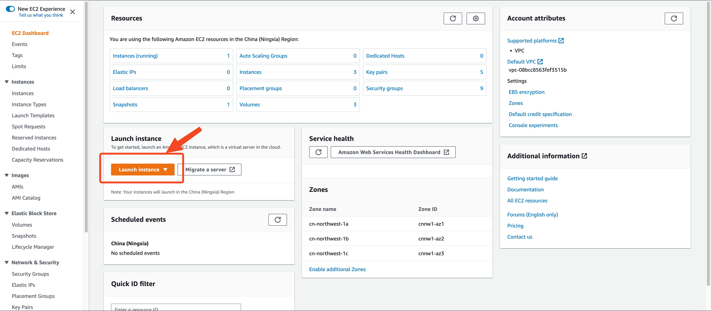

**2、填写EC2实例的Name，选择Amazon Linux**

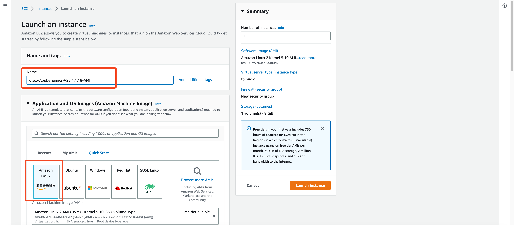

**3、选择实例类型c5.xlarge，不需要Key pair，选择公有子网，并自动分配公网IP地址。**

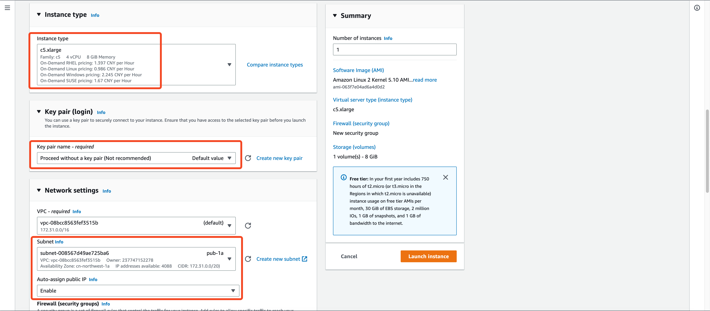

**4、设置Security Group ，设置磁盘大小500G**

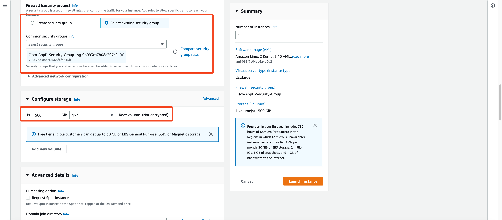

**Security Group的设置如下**

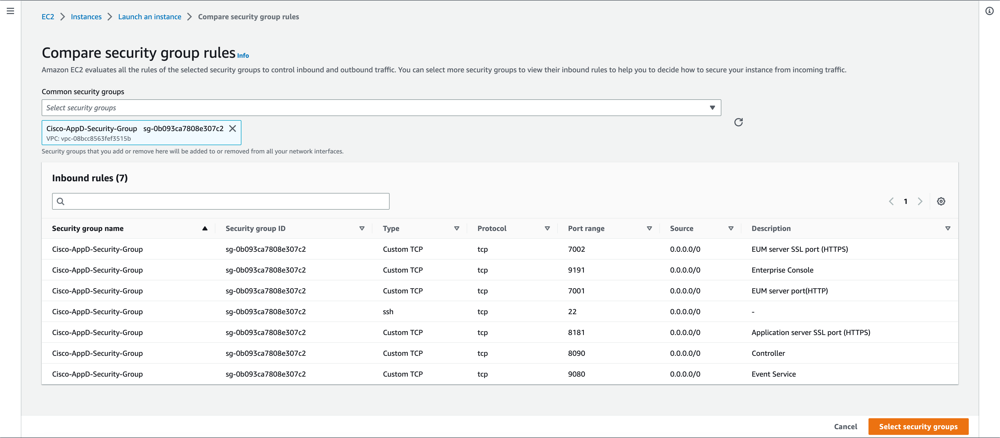

**5、分配IAM 角色**

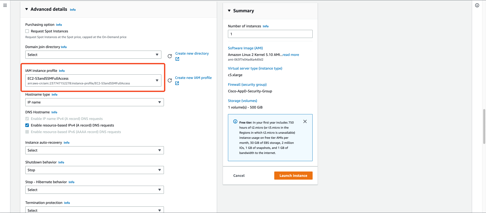

**IAM角色具体设置如下，设置SSM权限和S3的访问权限**

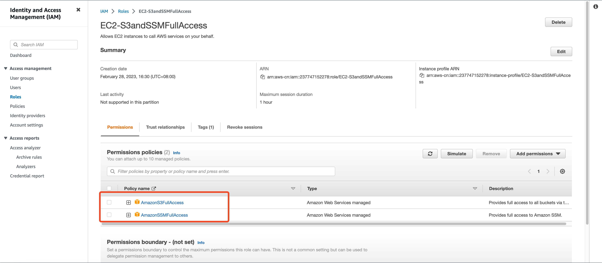

**6、将上述cloud-init 代码输入user-data中，并点击 Launch instance**


##  检查EC2实例的设置

**1、通过SSM连接EC2实例，如果未设置SSM的权限，则不能使用该方式管理EC2**

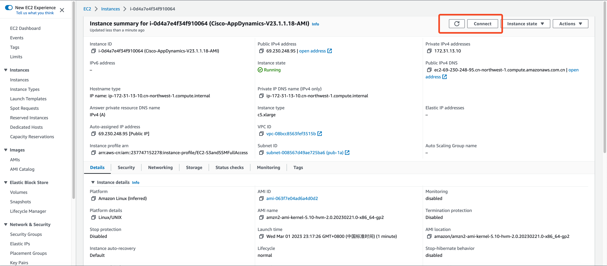

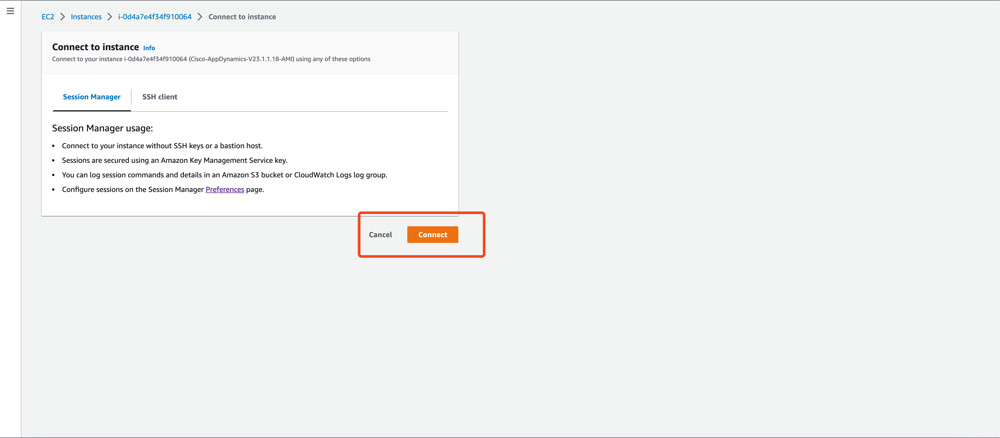

**2、执行命令检查EC2的设置是否符合预期**

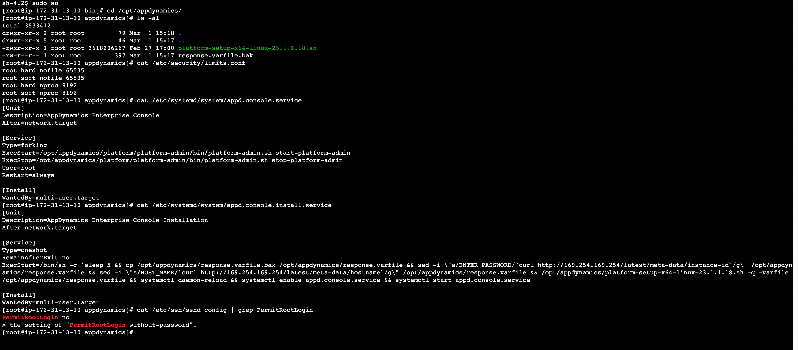

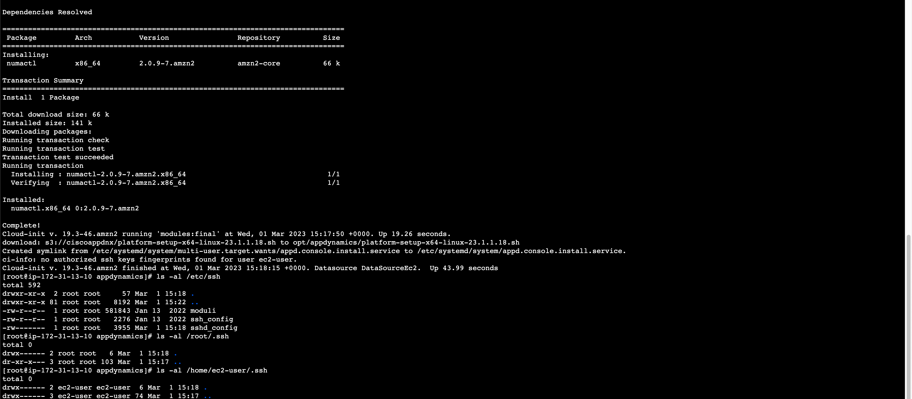

以下是文本格式的输出：

```bash
[root@ip-172-31-13-10 appdynamics]# cat /etc/security/limits.conf
root hard nofile 65535
root soft nofile 65535
root hard nproc 8192
root soft nproc 8192

[root@ip-172-31-13-10 appdynamics]# cat /etc/systemd/system/appd.console.service
[Unit]
Description=AppDynamics Enterprise Console
After=network.target

[Service]
Type=forking
ExecStart=/opt/appdynamics/platform/platform-admin/bin/platform-admin.sh start-platform-admin
ExecStop=/opt/appdynamics/platform/platform-admin/bin/platform-admin.sh stop-platform-admin
User=root
Restart=always

[Install]
WantedBy=multi-user.target

[root@ip-172-31-13-10 appdynamics]# cat /etc/systemd/system/appd.console.install.service
[Unit]
Description=AppDynamics Enterprise Console Installation
After=network.target

[Service]
Type=oneshot
RemainAfterExit=no
ExecStart=/bin/sh -c 'sleep 5 && cp /opt/appdynamics/response.varfile.bak /opt/appdynamics/response.varfile && sed -i \"s/ENTER_PASSWORD/`curl http://169.254.169.254/latest/meta-data/instance-id`/g\" /opt/appdynamics/response.varfile && sed -i \"s/HOST_NAME/`curl http://169.254.169.254/latest/meta-data/hostname`/g\" /opt/appdynamics/response.varfile && /opt/appdynamics/platform-setup-x64-linux-23.1.1.18.sh -q -varfile/opt/appdynamics/response.varfile && systemctl daemon-reload && systemctl enable appd.console.service && systemctl start appd.console.service'

[Install]
WantedBy=multi-user.target
```

**可以看出是符合预期的。**

**执行 history -c 清除历史记录。**

##  生成AMI镜像

**1、将该EC2关机**

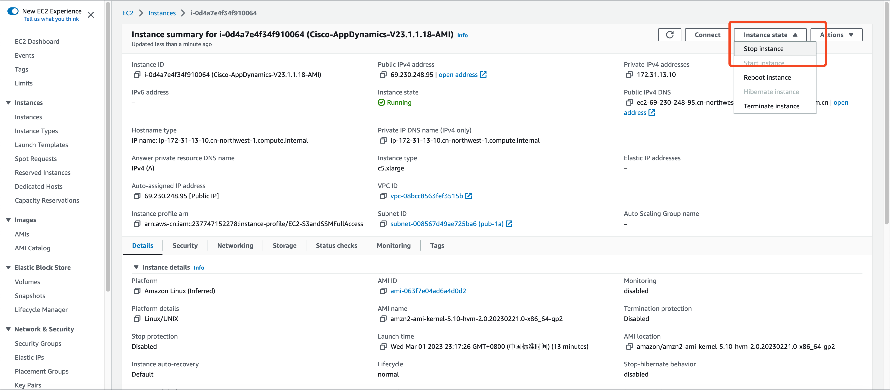

**2、确认关机后，点击制作Image**

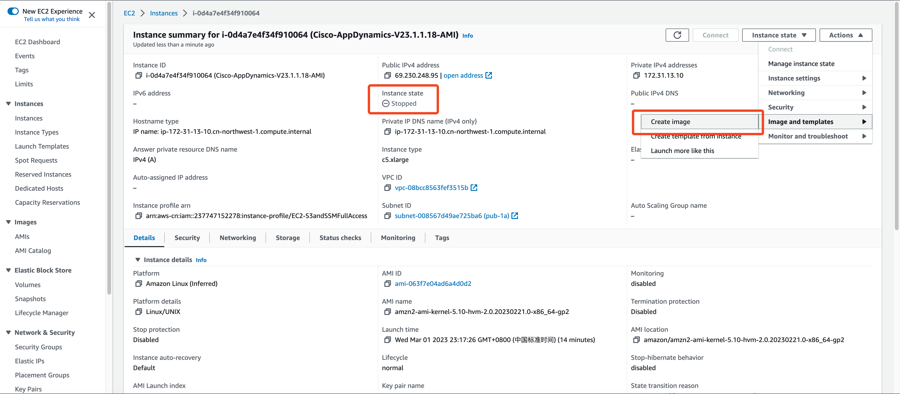

**3、填入Image的参数，点击Create Image**

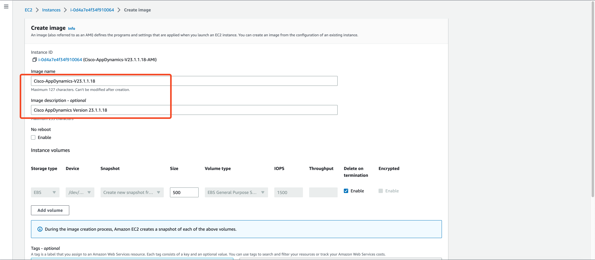

# 验证AMI

##  使用AMI启动EC2实例

**1、等待AMI状态变Available后，点击Launch instance from AMI**

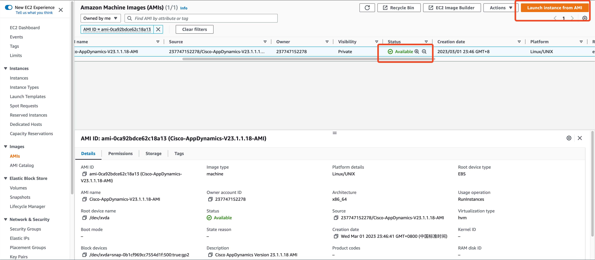

**2、进入EC2启动的设置页面，进行必要的设置**

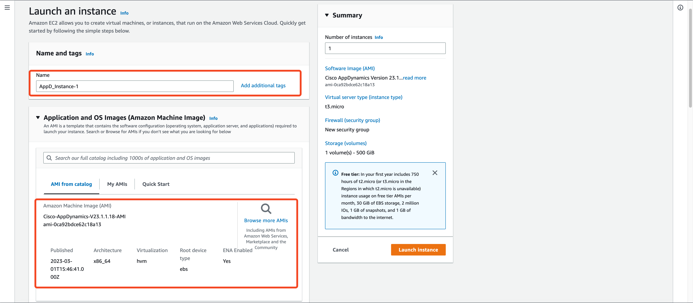

**除了user-data维持空白，其他设置可于创建AMI的EC2一致。**

**3、EC2创建后，转到EC2的信息页面**

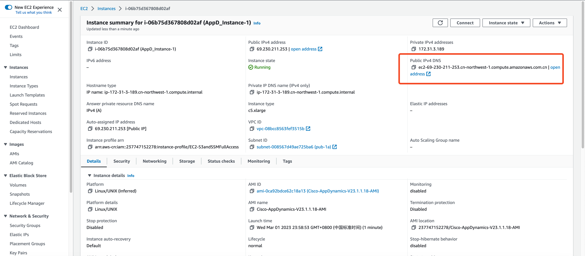

**4、测试Enterprise Console的Web界面**

大概10分钟后，可以通过以下地址访问

```bash
http://ec2-69-230-211-253.cn-northwest-1.compute.amazonaws.com.cn/:9191
username: admin
password: 从信息页面中拷贝instance-id，如上图为i-06b75d367808d02af
```


**5、使用SSM连接EC2，检查相关服务是否正常**

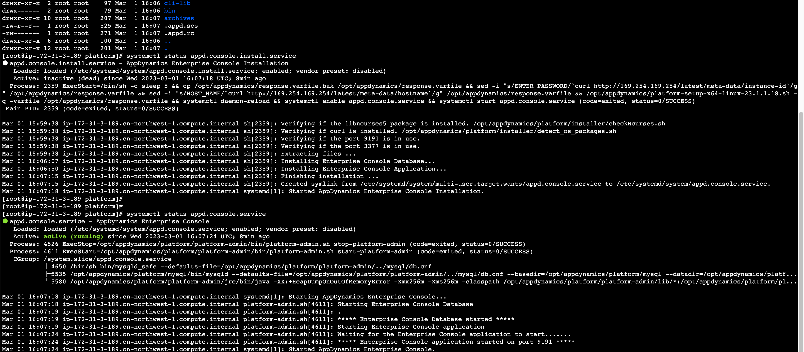

# 总结

本文整理了在AWS上制作AppDynamics的AMI镜像的过程，笔者使用了ChatGPT帮助生成自动化脚本，极大的提高了效率。
本文中的cloud-init代码已发布到Github，如下：

[https://github.com/weiborao/appd-console-install-cloud-init/blob/main/appd-install-cloud-init-CN.yaml](https://github.com/weiborao/appd-console-install-cloud-init/blob/main/appd-install-cloud-init-CN.yaml)

非常感谢各位耐心的阅读，谢谢。