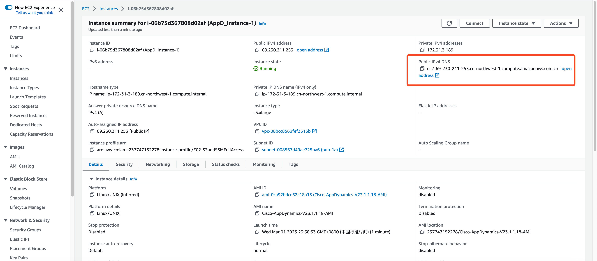

# 手工作坊与“云”格格不入

Cisco AppDynamics 提供功能强大、易于使用的应用程序性能管理（APM）解决方案，端到端监控亚马逊云的应用程序，包括微服务和 Docker，通过 CloudWatch 集成为 EC2、DynamoDB、Lambda 等提供支持。AppDynamics可比较和验证云迁移前后的从客户到业务的优化，从而加速客户上云，因而深受用户喜爱。

为了提升用户在亚马逊云科技云端安装部署AppDynamics软件的效率，我们需要制作一个打包好的安装镜像，叫做Amazon Machine Images (AMI)。用户使用AMI镜像启动虚拟机即可进入AppDynamics的设置界面，这能帮助用户节省大量软件下载、安装调试的时间，极大改善用户的安装体验。

我们采用什么方式来制作AMI镜像呢？

使用纯手工方式当然可以完成制作，但是这个AMI镜像封存了整个虚拟机的磁盘，包括操作系统和软件包。如果AppDynamics软件发布新版本，或者操作系统发现安全漏洞，就需要进行软件升级或系统漏洞修复的工作。在这种情况下，手工作坊难以招架，换句话说，在云的世界，没有手工作坊的一席之地，只有自动化一种选项。

那么，接下来的问题是：自动化需要工具和代码的支持，代码要怎么写呢？

笔者虽然能写点简单的Python代码、Shell脚本，可是要编写一个综合性的代码，恐怕没有两周时间，再加上掉几把头发是写不出来的。

<!-- more -->

# 网红ChatGPT登场

如果不知道ChatGPT是谁，请移步文章附录，文末有彩蛋。

## 牛刀小试，令人惊艳

笔者突发奇想，打开ChatGPT，开始了对话。


好家伙，ChatGPT的介绍比本文开篇介绍AppDynamics的内容写的更全面一些，笔者自愧不如。

话不多说，还是赶紧让ChatGPT写代码吧。

## 深入对话，理清需求

笔者将工作任务进行拆解，分多次与ChatGPT对话，把想要实现的功能逐步陈述清楚。

**关键需求：**

- 虚拟机开机即可进入AppDynamics的安装设置界面；
- 要求使用动态密码而非静态密码；
- 符合亚马逊云科技的安全合规要求，比如禁止root账号SSH登录，删除SSH密钥，不留后门等等。镜像制作完成后，亚马逊云科技会进行安全合规检查，不符合要求是不允许上架云市场的。

```bash
请你帮助生成一个Cloud-init代码，自动执行以下内容。

在AWS Console启动AWS Linux 2 AMI，并在启动时执行以下动作：
1、安装libaio, numactl, tzdata, ncurses-libs-5.x
2、在/etc/security/limits.conf 中添加以下配置
  root hard nofile 65535
  root soft nofile 65535
  root hard nproc 8192
  root soft nproc 8192
3、你已经会安装Cisco AppDynamics Enterprise Console 21.6.1版本，现在我将安装文件拷贝到了s3://ciscoappd/platform-setup-x64-linux-21.6.1.26487.sh。请创建/opt/appdynamics目录，将Cisco AppDynamics Enterprise Console的安装文件s3://ciscoappd/platform-setup-x64-linux-21.6.1.26487.sh拷贝至该目录，并将其设置为可执行；
4、在/opt/appdynamics目录，生成初始文件response.varfile.bak，内容如下：
  serverHostName=HOST_NAME
  sys.languageId=en
  disableEULA=true
  platformAdmin.port=9191
  platformAdmin.databasePort=3377
  platformAdmin.dataDir=/opt/appdynamics/platform/mysql/data
  platformAdmin.databasePassword=ENTER_PASSWORD
  platformAdmin.databaseRootPassword=ENTER_PASSWORD
  platformAdmin.adminPassword=ENTER_PASSWORD
  platformAdmin.useHttps$Boolean=false
  sys.installationDir=/opt/appdynamics/platform
上面的工作完成之后，再执行以下工作。

5、请生成一个开机启动脚本，要求如下：
5.1 该脚本不在本EC2实例中执行，将其设置为开机后延迟30秒之后再执行，脚本仅需执行一次；
5.2 将/opt/appdynamics/response.varfile.bak 复制为 opt/appdynamics/response.varfile
5.2 将/opt/appdynamics/response.varfile中的ENTER_PASSWORD替换为EC2 meta-data中的instance-id
5.3 将/opt/appdynamics/response.varfile中的HOST_NAME设置为EC2 meta-data中的hostname
5.4 静默安装Enterprise Console /opt/appdynamics/platform-setup-x64-linux-21.6.1.26487.sh -q -varfile /opt/appdynamics/response.varfile
6、生成Systemd的服务配置文件，要求开机只运行一次。
```

## 千言万语，汇成代码

经过笔者多次调试和修改，最终形成以下cloud-init代码如下：

```yaml
#cloud-config
packages:
  - libaio
  - numactl
  - tzdata
  - ncurses-libs-5.x

write_files:
  - path: /etc/security/limits.conf
    content: |
      root hard nofile 65535
      root soft nofile 65535
      root hard nproc 8192
      root soft nproc 8192

  - path: /opt/appdynamics/response.varfile.bak
    content: |
      serverHostName=HOST_NAME
      sys.languageId=en
      disableEULA=true
      platformAdmin.port=9191
      platformAdmin.databasePort=3377
      platformAdmin.dataDir=/opt/appdynamics/platform/mysql/data
      platformAdmin.databasePassword=ENTER_PASSWORD
      platformAdmin.databaseRootPassword=ENTER_PASSWORD
      platformAdmin.adminPassword=ENTER_PASSWORD
      platformAdmin.useHttps$Boolean=false
      sys.installationDir=/opt/appdynamics/platform

  - path: /etc/systemd/system/appd.console.service
    permissions: '0644'
    content: |
      [Unit]
      Description=AppDynamics Enterprise Console
      After=network.target

      [Service]
      Type=forking
      ExecStart=/opt/appdynamics/platform/platform-admin/bin/platform-admin.sh start-platform-admin
      ExecStop=/opt/appdynamics/platform/platform-admin/bin/platform-admin.sh stop-platform-admin
      User=root
      Restart=always

      [Install]
      WantedBy=multi-user.target

  - path: /etc/systemd/system/appd.console.install.service
    permissions: '0644'
    content: |
      [Unit]
      Description=AppDynamics Enterprise Console Installation
      After=network.target

      [Service]
      Type=oneshot
      RemainAfterExit=no
      ExecStart=/bin/sh -c 'sleep 5 && cp /opt/appdynamics/response.varfile.bak /opt/appdynamics/response.varfile && sed -i \"s/ENTER_PASSWORD/`curl http://169.254.169.254/latest/meta-data/instance-id`/g\" /opt/appdynamics/response.varfile && sed -i \"s/HOST_NAME/`curl http://169.254.169.254/latest/meta-data/hostname`/g\" /opt/appdynamics/response.varfile && /opt/appdynamics/platform-setup-x64-linux-23.1.1.18.sh -q -varfile /opt/appdynamics/response.varfile && systemctl daemon-reload && systemctl enable appd.console.service && systemctl start appd.console.service'

      [Install]
      WantedBy=multi-user.target

runcmd:
  # Create directory and copy Cisco AppDynamics Enterprise Console setup file
  - aws s3 cp s3://ciscoappdnx/platform-setup-x64-linux-23.1.1.18.sh /opt/appdynamics/ --region cn-northwest-1
  - chmod +x /opt/appdynamics/platform-setup-x64-linux-23.1.1.18.sh
  - systemctl daemon-reload
  - systemctl enable appd.console.install.service
  - sed -i 's/#PermitRootLogin yes/PermitRootLogin no/g' /etc/ssh/sshd_config
  - rm -rf /root/.ssh/authorized_keys
  - rm -rf /home/ec2-user/.ssh/authorized_keys
  - shred -u /etc/ssh/*_key /etc/ssh/*_key.pub
```

## 知己知彼，高效对话

与ChatGPT对话的一些经验：

- ChatGPT所掌握的数据截止到2021年9月，比如您问他卡塔尔世界杯的结果，他是不知道的。在经过多次与ChatGPT对话，它告诉我他能安装的AppDynamics最新版本是21.6.1，如果我请它直接安装23.1.1.18，它给出的代码有误。于是我请它按照21.6.1版本来安装，在上面的对话中可以看出有这部分的内容。
- 如果一次提问的需求过于复杂，它在生成代码时，会因意外中断，因此，要注意控制一次对话的长度和问题的复杂度。上面列出的对话内容是多次对话整理出来的。
- 如果它理解不对，可以直接指正它，把需求提地更具体，比如请使用‘write_files’和‘runcmd’生成代码。如果不加限制，它可能会给出整段代码全部都用 echo 语句来实现，相比结构化的代码，不易理解。

# 见证奇迹的时刻

## 启动云主机，执行脚本

填入其他必要的信息，并将上述cloud-init 代码粘贴到user-data中，再点击 Launch instance。


5分钟后即可关闭该云主机。

## 封存AMI镜像，并使用AMI启动云主机

基于上面的云主机封存AMI镜像，并使用该AMI镜像启动新的云主机。



## 奇迹发生：AppD服务界面启动成功

新的云主机启动大约10分钟后，可以通过以下地址访问：

```bash
http://ec2-69-230-211-253.cn-northwest-1.compute.amazonaws.com.cn/:9191
username: admin
password: 从信息页面中拷贝instance-id，如上图为i-06b75d367808d02af
```


# 总结

本文分享了笔者通过与“网红”ChatGPT进行对话生成自动化脚本，开发出一个可重复的、高效的过程来构建、更新和重新发布应用程序性能管理（APM）解决方案Cisco AppDynamics软件的AMI镜像的亲身经历。这个过程令笔者印象深刻，非常值得撰文记录下来。

关于人工智能，每个人心目中的看法不尽相同，但是我相信在不久的将来，人工智能的发展会令人瞠目结舌，让我们拭目以待吧。

独木不成舟，在本次制作Cisco AppDynamics的AMI镜像过程中，我得到了思科首席架构师魏航老师以及深圳市风向标信息技术有限公司秦总、赵工的支持和指导，在此表示诚挚的感谢。

上述的自动化过程还有考虑不周之处，比如没有针对异常的处理，往后如果有需要，笔者会继续改进。

# 附录：ChatGPT自我介绍


**文末彩蛋：**

本文的标题是ChatGPT帮助笔者生成的，不过它不知道自己是网红🤫，标题里的“网红”是笔者加的。