作者：Rao Weibo

版本：1.0

更新日期：20210203

本文提供在 CentOS 7 版本上安装 KVM，并安装和设置 CSR 1000v/Catalyst 8000v 的指南，内容包括 SRIOV，KVM 调优以及 CSR1KV 初始化配置等内容。

# CentOS7 安装及设置

## （1）BIOS 设置建议

| Configuration                       | Recommended Setting |
| :---------------------------------- | :------------------ |
| Intel Hyper-Threading Technology    | Disabled            |
| Number of Enable Cores              | ALL                 |
| Execute Disable                     | Enabled             |
| Intel VT                            | Enabled             |
| Intel VT-D                          | Enabled             |
| Intel VT-D coherency support        | Enabled             |
| Intel VT-D ATS support              | Enabled             |
| CPU Performance                     | High throughput     |
| Hardware Perfetcher                 | Disabled            |
| Adjacent Cache Line Prefetcher      | Disabled            |
| DCU Streamer Prefetch               | Disable             |
| Power Technology                    | Custom              |
| Enhanced Intel Speedstep Technology | Disabled            |
| Intel Turbo Boost Technology        | Enabled             |
| Processor Power State C6            | Disabled            |
| Processor Power State C1 Enhanced   | Disabled            |
| Frequency Poor Override             | Enabled             |
| P-State Coordination                | HW_ALL              |
| Energy Performance                  | Performance         |

以上建议来自 CSR 1000v 的安装指南。

## （2）CentOS 7 的安装

在安装的时候选择

- Server with GUI
- Virtualization Client
- Virtualization Hypervisor
- Virtualization Tools

启动完毕以后关闭 selinux，重启生效。

```shell
sed -i 's/SELINUX=enforcing/SELINUX=disabled/g' /etc/selinux/config

getenforce		//结果为：Enforcing（开启状态）disabled(关闭状态)
```

```shell
# 安装完后，SSH登录可能显示中文，可修改 .bash_profile

LANG="en_US.UTF-8"

export LANG

source .bash_profile

egrep -o '(vmx|svm)' /proc/cpuinfo | sort | uniq

# 注：在生产环境中，需要在服务器连接的交换机以及出口防火墙上做好安全策略。

systemctl stop firewalld

systemctl disable firewalld
```

本文档采用 NetworkManager 配置，故在此并不停用 NetworkManager。

```shell
cat /etc/sysctl.conf

net.ipv4.ip_forward = 1

net.bridge.bridge-nf-call-ip6tables = 0

net.bridge.bridge-nf-call-iptables = 0

net.bridge.bridge-nf-call-arptables = 0
```

检查 KVM 组件版本：

```shell
[root@centos7 ~]# libvirtd -V

libvirtd (libvirt) 4.5.0

[root@centos7 ~]# /usr/libexec/qemu-kvm --version

QEMU emulator version 1.5.3 (qemu-kvm-1.5.3-173.el7_8.3), Copyright (c) 2003-2008 Fabrice Bellard

[root@centos7 ~]# virt-manager --version

1.5.0

[root@centos7 ~]# modinfo kvm-intel

filename:       /lib/modules/3.10.0-1127.18.2.el7.x86_64/kernel/arch/x86/kvm/kvm-intel.ko.xz

[root@centos7 ~]# modinfo ixgbevf

filename:       /lib/modules/3.10.0-1127.18.2.el7.x86_64/kernel/drivers/net/ethernet/intel/ixgbevf/ixgbevf.ko.xz

version:        4.1.0-k-rh7.7
```

## （3）创建本地 Yum 源（可选）

```shell
# 1、备份本地/etc/yum.repos.d 目录下的yum源

cd /etc/yum.repos.d/

mkdir bak

mv C* bak/

# 2、上传CentOS-7-x86_64-Everything-2009.iso镜像到/opt

# 3、挂载镜像

mkdir -p /media/cdrom

mount -t iso9660 -o loop /opt/CentOS-7-x86_64-Everything-2009.iso /media/cdrom/

mount		//查看挂载信息

df -h

vi /etc/fstab

/opt/CentOS-7-x86_64-Everything-2009.iso    /media/cdrom    iso9660 loop 0 0

tail -1 /etc/fstab		//查看是否写入/etc/fstab

# 4、配置本地yum源

cd /etc/yum.repos.d/

vi local.repo

[local]

name=local

baseurl=file:///media/cdrom	   //前面的file://是协议,后面的/media/cdrom是光盘挂载点

gpgcheck=0		//1使用公钥验证rpm包的正确性,0不验证

enabled=1		//1启用yum源,0禁用yum源

yum install -y numactl telnet
```

运行 virt-manager 启动图形化界面。

如果对 virsh CLI 命令熟悉，可以使用 virsh 命令创建虚拟机。

## （4）服务器网卡配置—NetworkManager 配置

在终端界面，可以通过 nmtui 打开图形化界面进行设置；以下使用 nmcli 进行设置。

```shell
nmcli connection add con-name eno1 type ethernet autoconnect yes ifname eno1

nmcli connection modify eno1 ipv4.method manual ipv4.addresses 10.75.58.43/24 ipv4.gateway 10.75.58.1 ipv4.dns 64.104.123.245

nmcli connection up eno1

nmcli connection show eno1

ping 10.75.58.1
```

上述命令完成后，在/etc/sysconfig/network-scripts 中会生成网卡的 ifcfg 配置文件。

```shell
cat /etc/sysconfig/network-scripts/ifcfg-eno1

HWADDR=70:7D:B9:59:5B:AE

TYPE=Ethernet

PROXY_METHOD=none

BROWSER_ONLY=no

BOOTPROTO=none

IPADDR=10.75.58.43

PREFIX=24

GATEWAY=10.75.58.1

DNS1=64.104.123.245

DEFROUTE=yes

IPV4_FAILURE_FATAL=no

IPV6INIT=yes

IPV6_AUTOCONF=yes

IPV6_DEFROUTE=yes

IPV6_FAILURE_FATAL=no

IPV6_ADDR_GEN_MODE=stable-privacy

NAME=eno1

UUID=2a1c8b39-7f44-321b-a65f-a93e70ab0616

ONBOOT=yes

AUTOCONNECT_PRIORITY=-999

DEVICE=eno1
```

此时，可以将 network.service 停止和关闭。

```shell
systemctl stop network

systemctl disable network
```

注意，如果 NetworkManager 未设置妥当，执行 systemctl stop network 后，会导致服务器无法管理。

准备开启 SRIOV 的网卡设置，以 eno2 为例：

```bash
nmcli connection add con-name eno2 type ethernet autoconnect yes ifname eno2

nmcli connection modify eno2 ethernet.mtu 9216 ipv4.method disabled

nmcli connection up eno2

nmcli connection show eno2

ip link show dev eno2
```

注：上述 MTU 值设置为 9216 是借鉴自 Cisco NFVIS 平台，如下：

```ios
CSP5228-1# show pnic-detail mtu

Name          MTU

=============================

eth0-1        9216

eth0-2        9216

eth1-1        9216

eth1-2        9216
```

## （5）配置 Linux 网桥 （可选）

网桥 br1 配置示例：

```bash
nmcli connection add con-name br1 type bridge autoconnect yes ipv4.method disabled ethernet.mtu 9216 ifname br1

nmcli connection up br1

ip link show dev br1
```

网桥 br1 的物理网卡配置

```bash
nmcli connection add con-name eno5 type ethernet autoconnect yes ifname eno5

nmcli connection modify eno5 ethernet.mtu 9216 ipv4.method disabled master br1

nmcli connection up eno5

ip link show dev eno5
```

创建 net-br1 网络

[root@centos7 ~]# cat net-br1.xml

```xml
<network>

 <name>net-br1</name>

 <forward mode="bridge"/>

 <bridge name="br1"/>

</network>
```

```bash
[root@centos7 ~]# virsh net-define net-br1.xml

Network net-br1 defined from net-br1.xml

[root@centos7 ~]# virsh net-start net-br1

Network net-br1 started

[root@centos7 ~]# virsh net-autostart net-br1

Network net-br1 marked as autostarted
```

# 配置 SR-IOV

## （1）检查网卡对 SR-IOV 的支持，并配置网卡

可使用 lshw 和 lspci 检查网卡对 SR-IOV 的支持

lshw -c network -businfo

```shell
Bus info          Device      Class          Description

========================================================

pci@0000:1d:00.0  eno5        network        VIC Ethernet NIC

pci@0000:1d:00.1  eno6        network        VIC Ethernet NIC

pci@0000:1d:00.2  eno7        network        VIC Ethernet NIC

pci@0000:1d:00.3  eno8        network        VIC Ethernet NIC

pci@0000:3b:00.0  eno1        network        Ethernet Controller 10G X550T

pci@0000:3b:00.1  eno2        network        Ethernet Controller 10G X550T
```

lspci -vv -s 3b:00.1 | grep -A 5 -i SR-IOV

```bash
Capabilities: [160 v1] Single Root I/O Virtualization (SR-IOV)

  IOVCap:	Migration-, Interrupt Message Number: 000

	IOVCtl:	Enable+ Migration- Interrupt- MSE+ ARIHierarchy-

	IOVSta:	Migration-

	Initial VFs: 64, Total VFs: 64, Number of VFs: 8, Function Dependency Link: 01

	VF offset: 128, stride: 2, Device ID: 1565
```

## （2）设置启动参数

```shell
vi /etc/default/grub

GRUB_CMDLINE_LINUX="crashkernel=auto spectre_v2=retpoline rd.lvm.lv=centos/root rd.lvm.lv=centos/swap rhgb quiet hugepagesz=1G hugepages=32 default_hugepagesz=1G intel_iommu=on iommu=pt isolcpus=1-8,37-44"

注：页面数字不要过大，不然启动失败，如果后续不够，可以在运行时添加。

grub2-mkconfig -o /boot/grub2/grub.cfg

grub2-mkconfig -o /boot/efi/EFI/centos/grub.cfg

iommu=pt 参数是将SRIOV设备支持PCI Passthrough
```

重启后验证

```shell
cat /proc/cmdline |grep intel_iommu=on

dmesg |grep -e DMAR -e IOMMU

dmesg | grep -e DMAR -e IOMMU -e AMD-Vi
```

- **default_hugepagesz=1G hugepagesz=1G hugepages=32** 参数设置主机在启动时分配 32 个 1GB 的内存大页，这些是静态内存大页。 CSR 1000v 虚拟机将试用这些静态大页以获得最优性能。
- **isolcpus=1-8,37-44** 参数设置的作用是隔离 1-8，37-44 的 CPU 核，使其独立于内核的平衡调度算法，也就是内核本身不会将进程分配到被隔离的 CPU。之后我们可将指定的进程 CSR 1000v 虚拟机绑定到被隔离的 CPU 上运行，让进程独占 CPU，使其实时性可得到一定程度的提高。

可参考 这个章节获取主机 CPU 核的相关信息。

```shell
root@centos7 ~]# cat /proc/cmdline |grep intel_iommu=on

BOOT_IMAGE=/vmlinuz-3.10.0-1127.el7.x86_64 root=/dev/mapper/centos-root ro crashkernel=auto spectre_v2=retpoline rd.lvm.lv=centos/root rd.lvm.lv=centos/swap rhgb quiet hugepagesz=1G hugepages=32 default_hugepagesz=1G intel_iommu=on iommu=pt LANG=en_US.UTF-8

[root@centos7 ~]# dmesg |grep -e DMAR -e IOMMU

[    0.000000] ACPI: DMAR 000000005d6f5d70 00250 (v01 Cisco0 CiscoUCS 00000001 INTL 20091013)

[    0.000000] DMAR: IOMMU enabled
```

查看隔离的 CPU 核以及所有的 CPU 核。

```bash
[root@centos7 ~]# cat /sys/devices/system/cpu/isolated

1-8,37-44

[root@centos7 ~]# cat /sys/devices/system/cpu/present

0-71
```

## （3）通过 nmcli 持久化 VFs 配置

nmcli 可以设置网卡的 sriov 参数，如下：

```bash
nmcli connection modify eno2 sriov.total-vfs 4
```

还可以设置每一个 VF 设备的 MAC 地址，便于管理：

```bash
nmcli connection modify eno2 sriov.vfs '0 mac=8E:DF:08:C1:D1:DE trust=true, 1 mac=5A:B9:2F:99:A6:CE trust=true, 2 mac=46:78:69:E3:71:3D trust=true, 3 mac=7E:A7:DB:3B:1B:B3 trust=true'
```

执行上述命令后：

cat /etc/sysconfig/network-scripts/ifcfg-eno2

```bash
TYPE=Ethernet

NAME=eno2

UUID=64ffa204-0158-40c8-ba86-2b7aebf27619

DEVICE=eno2

ONBOOT=yes

MTU=9216

HWADDR=70:7D:B9:59:5B:AF

PROXY_METHOD=none

BROWSER_ONLY=no

IPV6INIT=no

SRIOV_TOTAL_VFS=4

SRIOV_VF0="mac=8E:DF:08:C1:D1:DE trust=true"

SRIOV_VF1="mac=5A:B9:2F:99:A6:CE trust=true"

SRIOV_VF2="mac=46:78:69:E3:71:3D trust=true"

SRIOV_VF3="mac=7E:A7:DB:3B:1B:B3 trust=true"
```

重启后，检查 dmesg：

dmesg | grep -i vf | grep -i eno2

```bash
[   11.953333] ixgbe 0000:3b:00.1 eno2: SR-IOV enabled with 4 VFs

[   12.541801] ixgbe 0000:3b:00.1: setting MAC 8e:df:08:c1:d1:de on VF 0

[   12.541805] ixgbe 0000:3b:00.1: Reload the VF driver to make this change effective.

[   12.541841] ixgbe 0000:3b:00.1 eno2: VF 0 is trusted

[   12.541846] ixgbe 0000:3b:00.1: setting MAC 5a:b9:2f:99:a6:ce on VF 1

[   12.541850] ixgbe 0000:3b:00.1: Reload the VF driver to make this change effective.

[   12.541883] ixgbe 0000:3b:00.1 eno2: VF 1 is trusted

[   12.541887] ixgbe 0000:3b:00.1: setting MAC 46:78:69:e3:71:3d on VF 2

[   12.541891] ixgbe 0000:3b:00.1: Reload the VF driver to make this change effective.

[   12.541923] ixgbe 0000:3b:00.1 eno2: VF 2 is trusted

[   12.541928] ixgbe 0000:3b:00.1: setting MAC 7e:a7:db:3b:1b:b3 on VF 3

[   12.541932] ixgbe 0000:3b:00.1: Reload the VF driver to make this change effective.

[   12.541965] ixgbe 0000:3b:00.1 eno2: VF 3 is trusted
```

## （4）检查 VF

可通过 lspci 和 ip link 检查 VF，如下：

```bash
[root@centos7 ~]# lspci | grep -i Virtual

[root@centos7 ~]# ip link show | grep -B2 vf
```

寻找 Physical Function 和 Virtual Function 之间的对应关系：

```bash
[root@centos7 ~]# ls -l /sys/class/net/eno1/device/ | grep virtfn
```

VF 被创建后，NetworkManager 自动给新的设备创建 Connection，可以修改名称，如下：

nmcli connection

```bash
NAME        UUID                                  TYPE      DEVICE

eno1        2a1c8b39-7f44-321b-a65f-a93e70ab0616  ethernet  eno1

eno2        64ffa204-0158-40c8-ba86-2b7aebf27619  ethernet  eno2

enp59s16f1  19c28a93-aa36-38e6-a556-55a922a0a332  ethernet  enp59s16f1

enp59s16f3  428d9707-1515-3475-b356-7eb229c3f937  ethernet  enp59s16f3

enp59s16f5  21a8dd5f-239f-37b2-9b09-24ce0e7413bc  ethernet  enp59s16f5

enp59s16f7  0ca0da65-64c4-314d-89a4-4213f9e4f478  ethernet  enp59s16f7
```

修改名称：

```bash
nmcli connection modify uuid 19c28a93-aa36-38e6-a556-55a922a0a332 connection.id enp59s16f1
```

修改 MTU 值，并禁用 IPv4 和 IPv6，网卡启动更快

```bash
nmcli connection modify enp59s16f1 ifname enp59s16f1 ipv4.method disabled ipv6.method ignore ethernet.mtu 9216 ethernet.mac-address ""

nmcli connection up enp59s16f1

nmcli connection show enp59s16f1
```

上述命令生成的 ifcfg 配置文件如下：

[root@centos7 ~]# cat /etc/sysconfig/network-scripts/ifcfg-enp59s16f1

```bash
TYPE=Ethernet

PROXY_METHOD=none

BROWSER_ONLY=no

DEFROUTE=yes

IPV4_FAILURE_FATAL=no

IPV6INIT=no

IPV6_AUTOCONF=no

IPV6_DEFROUTE=yes

IPV6_FAILURE_FATAL=no

IPV6_ADDR_GEN_MODE=stable-privacy

NAME=enp59s16f1

UUID=19c28a93-aa36-38e6-a556-55a922a0a332

ONBOOT=yes

AUTOCONNECT_PRIORITY=-999

DEVICE=enp59s16f1

MTU=9216
```

这样，即便系统重启，上述配置依然能生效。

# 使用 KVM 的虚拟网络适配器池

主机上创建一个 VF 网络设备的资源池，资源池内的设备可以自动地分配给虚拟机使用。

## （1）创建一个 xml 文件。

[root@centos7 ~]# cat eno2_sriov_pool.xml

```xml
<network>

  <name>eno2_sriov_pool</name> <!-- This is the name of the file you created -->

  <forward mode='hostdev' managed='yes'>

   <pf dev='eno2'/> <!-- Use the netdev name of your SR-IOV devices PF here -->

  </forward>

</network>
```

## （2）根据 xml 定义一个网络，并设置为自动重启

```bash
virsh net-define eno2_sriov_pool.xml

virsh net-start eno2_sriov_pool

virsh net-autostart eno2_sriov_pool
```

[root@centos7 ~]# virsh net-dumpxml eno2_sriov_pool

```xml
<network connections='1'>

 <name>eno2_sriov_pool</name>

 <uuid>e0842451-0137-4255-8783-305ca27f082d</uuid>

 <forward mode='hostdev' managed='yes'>

  <pf dev='eno2'/>

  <address type='pci' domain='0x0000' bus='0x3b' slot='0x10' function='0x1'/>

  <address type='pci' domain='0x0000' bus='0x3b' slot='0x10' function='0x3'/>

  <address type='pci' domain='0x0000' bus='0x3b' slot='0x10' function='0x5'/>

  <address type='pci' domain='0x0000' bus='0x3b' slot='0x10' function='0x7'/>

 </forward>

</network>
```

## （3）从网络适配器池中分配网卡给虚拟机

用这种方法添加 SRIOV 网卡比较简单：

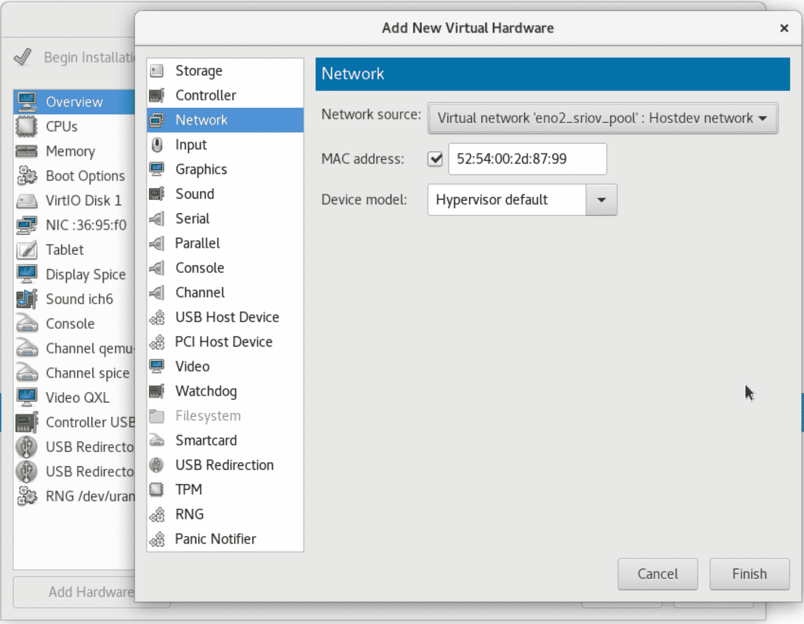

按照如上方法添加网卡，等同于以下 xml 配置：

```xml
  <interface type='network'>

   <mac address='52:54:00:2d:87:99'/>

   <source network='eno2_sriov_pool'/>

   <model type='virtio'/>

   <address type='pci' domain='0x0000' bus='0x00' slot='0x04' function='0x0'/>

  </interface>
```

开机后 dumpxml 如下：

```xml
  <interface type='hostdev' managed='yes'>

   <mac address='52:54:00:2d:87:99'/>

   <driver name='vfio'/>

   <source>

    <address type='pci' domain='0x0000' bus='0x3b' slot='0x10' function='0x1'/>

   </source>

   <model type='virtio'/>

   <alias name='hostdev0'/>

   <address type='pci' domain='0x0000' bus='0x00' slot='0x0f' function='0x0'/>

</interface>
```

# 使用 Virt-manager 安装 CSR1000v

在 CentOS 图形界面中，打开 Terminal，运行 virt-manager，按照以下步骤创建 CSR1000v；添加网卡，并选择 en2_sriov_pool。

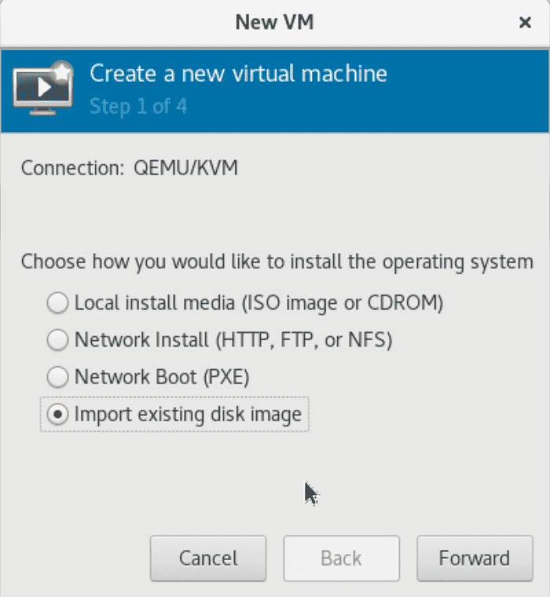

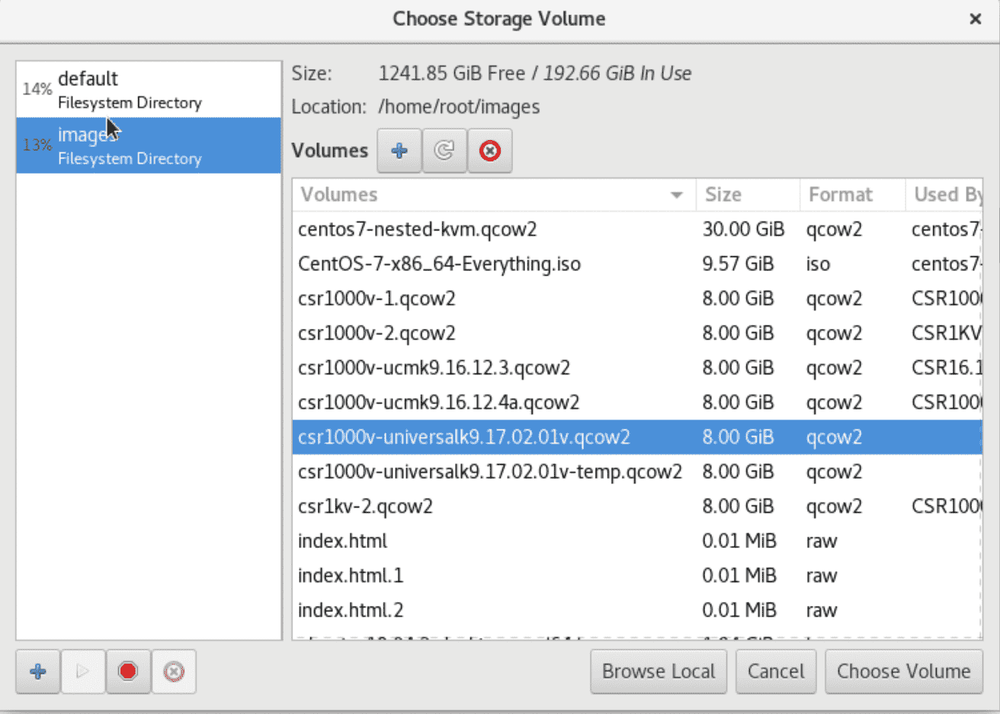

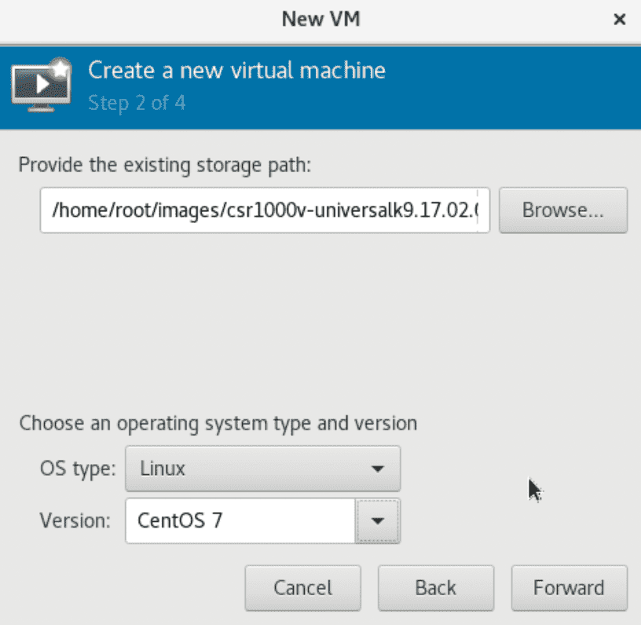


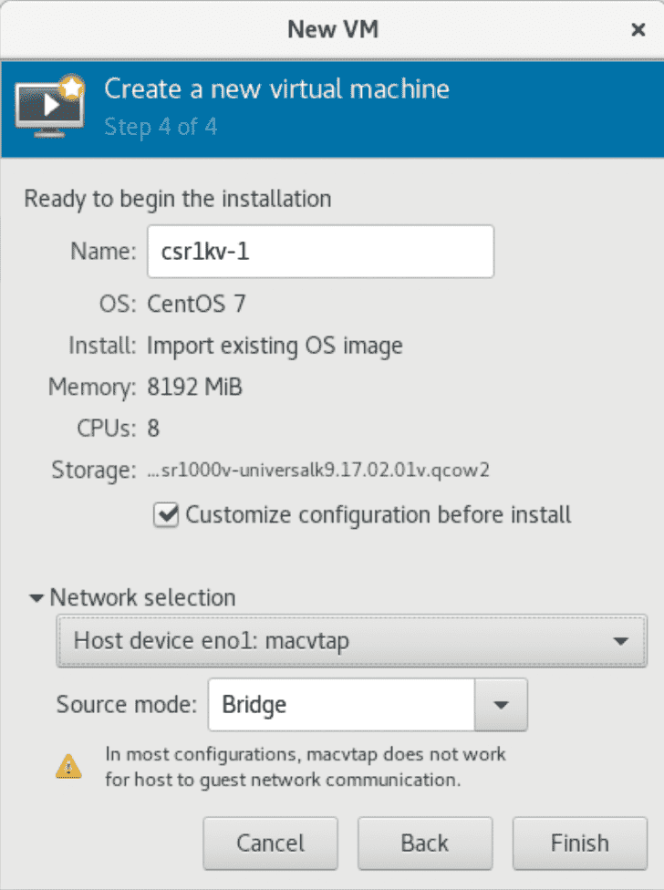

注：csr1kv-1 的第一个网口选择**macvtap Bridge**模式，这样就无需创建一个 Linux 网桥。但是，csr1kv-1 启动以后不能通过该接口与 Linux 主机进行通信，仅能通过该接口访问 Linux 主机外的网络。


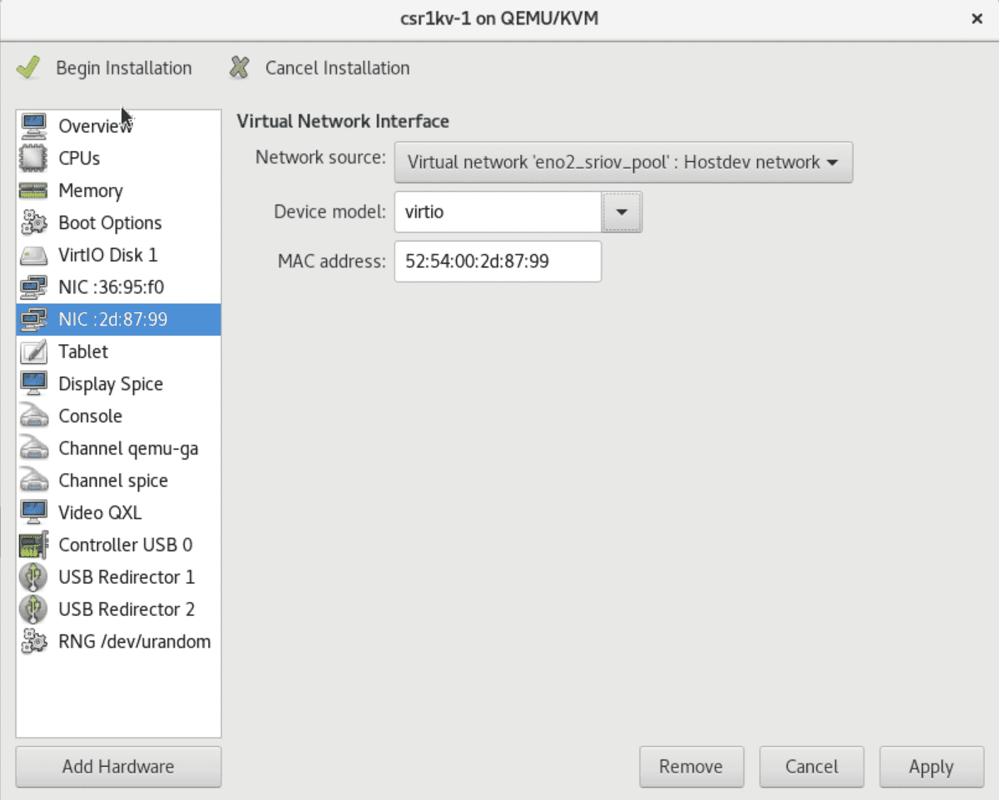

添加完网卡后，点击开始安装，然后就可以关闭虚拟机了。上述操作完成后，virt-manager 会在**/etc/libvirtd/qemu/**目录下创建**csr1kv-1.xml**。

# KVM 调优配置

KVM 的调优比较复杂，主要是 NUMA、内存大页、vCPU PIN 等，参考资料为 Redhat Linux 7 PERFORMANCE TUNING GUIDE。

## （1）检查平台的能力

```bash
[root@centos7 ~]# virsh nodeinfo

CPU model:           x86_64

CPU(s):              72

CPU frequency:       999 MHz

CPU socket(s):       1

Core(s) per socket:  18

Thread(s) per core:  2

NUMA cell(s):        2

Memory size:         263665612 KiB
```

```bash
[root@centos7 ~]# virsh capabilities

<capabilities>

 <host>

  <uuid>4e53df1f-5b36-6842-99ee-1369d7c68730</uuid>

  <cpu>

   <arch>x86_64</arch>

   <model>Skylake-Server-IBRS</model>

   <vendor>Intel</vendor>

   <microcode version='33581318'/>

   <counter name='tsc' frequency='2294597000' scaling='yes'/>

   <topology sockets='1' cores='18' threads='2'/>

……
```

可检查平台的 CPU 核数、分布，内存的 NUMA 分布等。

## （2）NUMA 调优

```bash
[root@centos7 ~]# numactl --hardware

available: 2 nodes (0-1)

node 0 cpus: 0 1 2 3 4 5 6 7 8 9 10 11 12 13 14 15 16 17 36 37 38 39 40 41 42 43 44 45 46 47 48 49 50 51 52 53

node 0 size: 128491 MB

node 0 free: 112157 MB

node 1 cpus: 18 19 20 21 22 23 24 25 26 27 28 29 30 31 32 33 34 35 54 55 56 57 58 59 60 61 62 63 64 65 66 67 68 69 70 71

node 1 size: 128994 MB

node 1 free: 124120 MB

node distances:

node  0  1

 0: 10 21

 1: 21 10
```

两颗 CPU，每颗 CPU 各有 128GB 内存，分别是 node 0 和 node 1。

## （3）内存大页 HugePage 以及透明大页

` `cat /proc/meminfo | grep HugePages 查看当前系统有多少个大页：

```bash
[root@centos7 ~]# cat /proc/meminfo | grep Huge

AnonHugePages:   1685504 kB

HugePages_Total:      64

HugePages_Free:       60

HugePages_Rsvd:        0

HugePages_Surp:        0

Hugepagesize:    1048576 kB
```

在系统运行时修改大页数量：

```bash
[root@centos7 ~]# cat /sys/devices/system/node/node0/hugepages/hugepages-1048576kB/nr_hugepages

16

[root@centos7 ~]# echo 32 > /sys/devices/system/node/node0/hugepages/hugepages-1048576kB/nr_hugepages

[root@centos7 ~]# echo 32 > /sys/devices/system/node/node1/hugepages/hugepages-1048576kB/nr_hugepages

[root@centos7 ~]#

[root@centos7 ~]# numastat -cm | egrep 'Node|Huge'

`                 `Node 0 Node 1  Total

AnonHugePages     10962   1528  12490

HugePages_Total   32768  32768  65536

HugePages_Free    32768  32768  65536

HugePages_Surp        0      0      0
```

检查透明大页参数，在 CentOS7 上缺省开启；开启了透明大页，不影响静态大页的使用。

```bash
cat /sys/kernel/mm/transparent_hugepage/enabled

[always] madvise never
```

## （4）vCPU 钉选

设置 CPU Affinity 的好处是提高 CPU 缓存效率，避免进程在多个 CPU 核之间跳跃，切换 CPU 核均会导致缓存中的数据无效，缓存命中率大幅降低，导致数据获取的开销居高不下，损失性能。

**virsh vcpuinfo csr1kv-1** 可以查看 vCPU 的分配。

## （5）编辑 CSR 1000v 的 XML 调优参数

virsh edit csr1kv-1 可以编辑 XML 的参数，如下：

```xml
  <memoryBacking>
    <hugepages>
      <page size='1048576' unit='KiB'/>
    </hugepages>
    <locked/>
    <nosharepages/>
  </memoryBacking>
  <vcpu placement='static'>8</vcpu>
  <cputune>
    <vcpupin vcpu='0' cpuset='1'/>
    <vcpupin vcpu='1' cpuset='2'/>
    <vcpupin vcpu='2' cpuset='3'/>
    <vcpupin vcpu='3' cpuset='4'/>
    <vcpupin vcpu='4' cpuset='5'/>
    <vcpupin vcpu='5' cpuset='6'/>
    <vcpupin vcpu='6' cpuset='7'/>
    <vcpupin vcpu='7' cpuset='8'/>
    <emulatorpin cpuset='45-52'/> <!-- If Hyper-threading were enabled -->
  </cputune>
  <numatune>
    <memory mode='strict' nodeset='0'/>
  </numatune>
  <cpu mode='host-passthrough' check='none'/>
    <memballoon model='none'/>
```

注：**<emulatorpin cpuset='37-44'/>** 参数，仅当 Hyper-Threating 开启时使用；有一些平台并未关闭超线程，例如 Cisco 专门的 NFV 平台 CSP。通过 virsh chapabilities 查看 siblings='1,37'，当 core 1 设置为 vcpupin 时，core 37 应设置到 emulatorpin cpuset 中。

以下关于 CPU 和内存的参数设定建议来自于<https://libvirt.org/formatdomain.html> 和 <https://libvirt.org/kbase/kvm-realtime.html>

```xml
<domain type='kvm'>
  <name>csr1kv-1</name>
  <uuid>59581018-6387-49df-ab09-2bcf40fc12ba</uuid>
  <memory unit='KiB'>8388608</memory>
  <currentMemory unit='KiB'>8388608</currentMemory>
  <memoryBacking>
    <hugepages>
      <page size='1048576' unit='KiB'/>
</hugepages>
<locked/>
    <nosharepages/>
  </memoryBacking>
  <vcpu placement='static'>8</vcpu>
  <cputune>
    <vcpupin vcpu='0' cpuset='1'/>
    <vcpupin vcpu='1' cpuset='2'/>
    <vcpupin vcpu='2' cpuset='3'/>
    <vcpupin vcpu='3' cpuset='4'/>
    <vcpupin vcpu='4' cpuset='5'/>
    <vcpupin vcpu='5' cpuset='6'/>
    <vcpupin vcpu='6' cpuset='7'/>
    <vcpupin vcpu='7' cpuset='8'/>
    <emulatorpin cpuset='37-44'/>
  </cputune>
  <numatune>
    <memory mode='strict' nodeset='0'/>
  </numatune>
  <os>
    <type arch='x86_64' machine='pc-i440fx-rhel7.0.0'>hvm</type>
    <boot dev='hd'/>
  </os>
  <features>
    <acpi/>
    <apic/>
  </features>
  <cpu mode='host-passthrough' check='none'/>
  <clock offset='utc'>
    <timer name='rtc' tickpolicy='catchup'/>
    <timer name='pit' tickpolicy='delay'/>
    <timer name='hpet' present='no'/>
  </clock>
  <on_poweroff>destroy</on_poweroff>
  <on_reboot>restart</on_reboot>
  <on_crash>destroy</on_crash>
  <pm>
    <suspend-to-mem enabled='no'/>
    <suspend-to-disk enabled='no'/>
  </pm>
  <devices>
    <emulator>/usr/libexec/qemu-kvm</emulator>
    <disk type='file' device='disk'>
      <driver name='qemu' type='qcow2'/>
      <source file='/home/root/images/csr1000v-universalk9.17.02.01v.qcow2'/>
      <target dev='vda' bus='virtio'/>
      <address type='pci' domain='0x0000' bus='0x00' slot='0x07' function='0x0'/>
    </disk>
    <controller type='usb' index='0' model='ich9-ehci1'>
      <address type='pci' domain='0x0000' bus='0x00' slot='0x05' function='0x7'/>
    </controller>
    <controller type='usb' index='0' model='ich9-uhci1'>
      <master startport='0'/>
      <address type='pci' domain='0x0000' bus='0x00' slot='0x05' function='0x0' multifunction='on'/>
    </controller>
    <controller type='usb' index='0' model='ich9-uhci2'>
      <master startport='2'/>
      <address type='pci' domain='0x0000' bus='0x00' slot='0x05' function='0x1'/>
    </controller>
    <controller type='usb' index='0' model='ich9-uhci3'>
      <master startport='4'/>
      <address type='pci' domain='0x0000' bus='0x00' slot='0x05' function='0x2'/>
    </controller>
    <controller type='pci' index='0' model='pci-root'/>
    <controller type='virtio-serial' index='0'>
      <address type='pci' domain='0x0000' bus='0x00' slot='0x06' function='0x0'/>
    </controller>
    <interface type='direct'>
      <mac address='52:54:00:36:95:f0'/>
      <source dev='eno1' mode='bridge'/>
      <model type='virtio'/>
      <address type='pci' domain='0x0000' bus='0x00' slot='0x03' function='0x0'/>
    </interface>
    <interface type='network'>
      <mac address='52:54:00:2d:87:99'/>
      <source network='eno2_sriov_pool'/>
      <model type='virtio'/>
      <address type='pci' domain='0x0000' bus='0x00' slot='0x04' function='0x0'/>
    </interface>
    <serial type='pty'>
      <target type='isa-serial' port='0'>
        <model name='isa-serial'/>
      </target>
    </serial>
    <console type='pty'>
      <target type='serial' port='0'/>
    </console>
    <channel type='unix'>
      <target type='virtio' name='org.qemu.guest_agent.0'/>
      <address type='virtio-serial' controller='0' bus='0' port='1'/>
    </channel>
    <channel type='spicevmc'>
      <target type='virtio' name='com.redhat.spice.0'/>
      <address type='virtio-serial' controller='0' bus='0' port='2'/>
    </channel>
    <input type='tablet' bus='usb'>
      <address type='usb' bus='0' port='1'/>
    </input>
    <input type='mouse' bus='ps2'/>
    <input type='keyboard' bus='ps2'/>
    <graphics type='spice' autoport='yes'>
      <listen type='address'/>
      <image compression='off'/>
    </graphics>
    <video>
      <model type='qxl' ram='65536' vram='65536' vgamem='16384' heads='1' primary='yes'/>
      <address type='pci' domain='0x0000' bus='0x00' slot='0x02' function='0x0'/>
    </video>
    <redirdev bus='usb' type='spicevmc'>
      <address type='usb' bus='0' port='2'/>
    </redirdev>
    <redirdev bus='usb' type='spicevmc'>
      <address type='usb' bus='0' port='3'/>
    </redirdev>
    <memballoon model='none'/>
    <rng model='virtio'>
      <backend model='random'>/dev/urandom</backend>
      <address type='pci' domain='0x0000' bus='0x00' slot='0x09' function='0x0'/>
    </rng>
  </devices>
</domain>
```

上述参数整理自[《Cisco CSR 1000v and Cisco ISRv Software Configuration Guide》](https://www.cisco.com/c/en/us/td/docs/routers/csr1000/software/configuration/b_CSR1000v_Configuration_Guide/b_CSR1000v_Configuration_Guide_chapter_0101.html)

完成上述 XML 文件的编辑后，执行

```bash
cd /etc/libvirtd/qemu

virsh define csr1kv-1.xml

virsh start csr1kv-1
```

## （6）在 KVM 主机上访问 CSR1000v 的 Console

在 virt-manager 创建 CSR1000v 虚拟机的时候，缺省会添加一个 Serial Device。

```bash
[root@centos7 qemu]# virsh console 20

Connected to domain CSR1000v-1

Escape character is ^]
```

CSR 1000v 暂时不能通过 Console 配置，需要通过 virt-manager 的图形化界面进行初始化配置。

vCloud 的 Console 访问正常。

## （7）检验 CSR1000v 的调优配置

```xml
[root@centos7 ~]# virsh list

Id  Name              State

----------------------------------------------------

 6   csr1kv-1            running


[root@centos7 ~]# virsh vcpuinfo 6

VCPU:      0

CPU:      1

State:     running

CPU time:    34.5s

CPU Affinity:  -y----------------------------------------------------------------------


VCPU:      1

CPU:      2

State:     running

CPU time:    32.0s

CPU Affinity:  --y---------------------------------------------------------------------


VCPU:      2

CPU:      3

State:     running

CPU time:    23.8s

CPU Affinity:  ---y--------------------------------------------------------------------


VCPU:      3

CPU:      4

State:     running

CPU time:    19.8s

CPU Affinity:  ----y-------------------------------------------------------------------


VCPU:      4

CPU:      5

State:     running

CPU time:    23.0s

CPU Affinity:  -----y------------------------------------------------------------------


VCPU:      5

CPU:      6

State:     running

CPU time:    23.4s

CPU Affinity:  ------y-----------------------------------------------------------------


VCPU:      6

CPU:      7

State:     running

CPU time:    28.5s

CPU Affinity:  -------y----------------------------------------------------------------


VCPU:      7

CPU:      8

State:     running

CPU time:    28.2s

CPU Affinity:  --------y---------------------------------------------------------------
```

以上显示 CSR1000v 虚拟机的 CPU 亲和性在 1-8 核上。

```bash
[root@centos7 ~]# numastat -c qemu-kvm

Per-node process memory usage (in MBs) for PID 46895 (qemu-kvm)

     Node 0 Node 1 Total

     ------ ------ -----

Huge    8192   0 8192

Heap    118   0  118

Stack     0   0   0

Private   144   7  151

------- ------ ------ -----

Total   8455   7 8461


```

以上显示，内存主要使用 Node 0。

```bash
[root@centos7 ~]# numastat -vm -p 13428 | grep HugePage

AnonHugePages       956.00     494.00     1450.00

HugePages_Total     16384.00    16384.00    32768.00

HugePages_Free      8192.00    16384.00    24576.00

HugePages_Surp       0.00       0.00      0.00
```

## （8）在 CSR1KV 上检查虚拟网卡

```ios
csr1kv-1#show platform software vnic-if interface-mapping

-------------------------------------------------------------

 Interface Name    Driver Name     Mac Addr

-------------------------------------------------------------

 GigabitEthernet2    net_ixgbe_vf    5254.002d.8799

 GigabitEthernet1    net_virtio     5254.0036.95f0
```

上述驱动名显示为 net_ixgbe_vf 表明该虚拟网卡是一个 SR-IOV 池中分配的 VF 设备。

# Linux 上抓取虚拟网卡的报文（参考）

查找虚拟机的网卡列表

```bash
[root@centos7 ~]# virsh domiflist 10

Interface Type    Source   Model    MAC

-------------------------------------------------------

vnet0   network  default  virtio   52:54:00:38:71:4a

macvtap0  direct   eno1    virtio   52:54:00:b2:70:90

vnet5   bridge   net-br1  virtio   52:54:00:69:93:23
```

抓取 vnet5 的报文

```bash
[root@centos7 ~]# tcpdump -i vnet5 -w ping.pcap

tcpdump: listening on vnet5, link-type EN10MB (Ethernet), capture size 262144 bytes

^C49 packets captured

51 packets received by filter

0 packets dropped by kernel
```

注：VF 如果被分配给虚拟机，那么在 Linux 主机里，通过 ip link 则查看不到该设备，无法通过上述办法抓包。

# CSR 1000v 的初始化配置及 Smart License 注册

## （1）CSR 1000v 初始化配置示例

部分节略，其他为缺省配置。

```ios
CSR1000v-1#show sdwan running-config

system

 system-ip       1.1.10.1

 site-id        101

 sp-organization-name CiscoBJ

 organization-name   CiscoBJ

 vbond 10.75.58.51 port 12346

!

hostname CSR1000v-1

username admin privilege 15 secret 9 $9$4/QL2V2K4/6H1k$XUmRNf.T7t3KDOj/FmoNexpEypCxr482dExXHDnohSI

ip name-server 64.104.123.245

ip route 0.0.0.0 0.0.0.0 10.75.59.1


interface GigabitEthernet1

 no shutdown

 arp timeout 1200

 ip address 10.75.59.35 255.255.255.0

 no ip redirects

 ip mtu  1500

 mtu 1500

 negotiation auto

exit


interface Tunnel1

 no shutdown

 ip unnumbered GigabitEthernet1

 no ip redirects

 ipv6 unnumbered GigabitEthernet1

 no ipv6 redirects

 tunnel source GigabitEthernet1

 tunnel mode sdwan

exit


clock timezone CST 8 0

ntp server 10.75.58.1 version 4

sdwan

 interface GigabitEthernet1

 tunnel-interface

  encapsulation ipsec

  allow-service sshd

 exit
```

## （2）常用命令

- show sdwan control local-properties
- show sdwan control connections
- show sdwan control connection-history
- show sdwan running-config
- show sdwan bfd sessions
- show sdwan omp peers
- show sdwan omp routes

## （3）CSR 1000v Smart License 注册

CSR 1000v 默认限速为 250Mbps，需要注册 Smart License 才可解开限速。

```ios
CSR1000v-2#show platform hardware throughput level

The current throughput level is 250000 kb/s
```

注册 Smart License 需要满足以下条件：

1、 CSR 1000v 已经注册到 vManage，控制面连接正常；

2、 配置 ip http client source-interface GigabitEthernet2

3、 sdwan interface GigabitEthernet2 tunnel-interface allow-service all ---针对 16.12.x 版本；在新版本中仅需要 allow https

4、 CSR 1000v 可以访问 URL：<https://tools.cisco.com/its/service/oddce/services/DDCEService>

允许访问 114.114.114.114，CSR 1000v 可解析域名 tools.cisco.com

替代办法，增加一条命令 ip host tools.cisco.com 72.163.4.38

执行 license smart register idtoken xxxxxx 进行注册

show license status 查看注册结果

注册完成后，系统解开限速：

```ios
CSR1000v-1#show platform hardware throughput level

The current throughput level is 200000000 kb/s
```

# 性能和相关限制

## （1）SRIOV 的性能

在上述 CSR1KV-1 安装好后，使用测试仪进行性能测试，测试条件中，设置丢包率为 0%，其性能如下：

| Packet Site | SDWAN Performance (Mbps) | CEF Performance (Mbps) |
| :---------- | :----------------------: | :--------------------: |
| 128Byte     |           800            |        2843.75         |
| 256Byte     |         1431.26          |        6500.00         |
| 512Byte     |         2581.26          |        10578.13        |
| 1024Byte    |         3731.26          |        15500.00        |
| 1400Byte    |         4306.26          |        18171.88        |

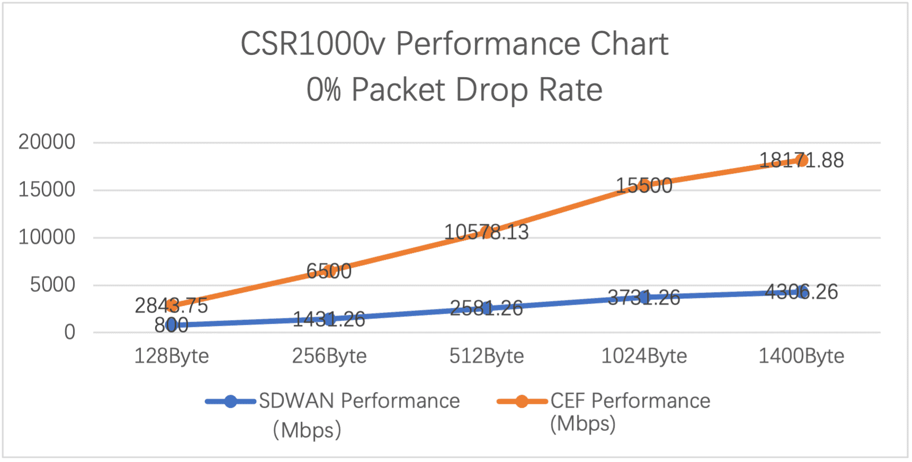

注：上述测试结果非官方结果，不同服务器和网卡可能测试结果有区别，上述性能数据仅供参考。

## （2）SRIOV 的限制

SRIOV 的主要限制是每一个 VF 设备支持的 VLAN 数，ixgbevf 所支持的最大 VLAN 数为 64；因此，在 CSR1KV 中对应的虚拟接口配置的活跃子接口数最大为 64。

配置指南中有关于 SRIOV 子接口限制的说明：

` `[Cisco CSR 1000v and Cisco ISRv Software Configuration Guide](https://www.cisco.com/c/en/us/td/docs/routers/csr1000/software/configuration/b_CSR1000v_Configuration_Guide/b_CSR1000v_Configuration_Guide_chapter_0101.html):

> SR-IOV (ixgbevf)
>
> Maximum VLANs: The maximum number of VLANs supported on PF is 64. Together, all VFs can have a total of 64 VLANs. (Intel limitation.)
>
> SR-IOV (i40evf)
>
> Maximum VLANs: The maximum number of VLANs supported on PF is 512. Together, all VFs can have a total of 512 VLANs. (Intel limitation.) Per-VF resources are managed by the PF (host) device driver.

# 附录

## （1）Virt-manager 设置虚机的 CPU 模式说明

Libvirt 主要支持三种 CPU mode：

- host-passthrough: libvirt 令 KVM 把宿主机的 CPU 指令集全部透传给虚拟机。因此虚拟机能够最大限度的使用宿主机 CPU 指令集，故性能是最好的。但是在热迁移时，它要求目的节点的 CPU 和源节点的一致。
- host-model: libvirt 根据当前宿主机 CPU 指令集从配置文件 /usr/share/libvirt/cpu_map.xml 选择一种最相配的 CPU 型号。在这种 mode 下，虚拟机的指令集往往比宿主机少，性能相对 host-passthrough 要差一点，但是热迁移时，它允许目的节点 CPU 和源节点的存在一定的差异。
- custom: 这种模式下虚拟机 CPU 指令集数最少，故性能相对最差，但是它在热迁移时跨不同型号 CPU 的能力最强。此外，custom 模式下支持用户添加额外的指令集。

三种 mode 的性能排序是：host-passthrough > host-model > custom

实际性能差异不大：100%> 95.84%>94.73%

引自：<http://wsfdl.com/openstack/2018/01/02/libvirt_cpu_mode.html>

## （2）有关网卡模式的说明

使用 virt-manager 创建虚拟机，在添加网卡时，有 3 中选择，分别是 e1000, rtl8139, virtio。

“rtl8139”这个网卡模式是 qemu-kvm 默认的模拟网卡类型，RTL8139 是 Realtek 半导体公司的一个 10/100M 网卡系列，是曾经非常流行（当然现在看来有点古老）且兼容性好的网卡，几乎所有的现代操作系统都对 RTL8139 网卡驱动的提供支持。

“e1000”系列提供 Intel e1000 系列的网卡模拟，纯的 QEMU（非 qemu-kvm）默认就是提供 Intel e1000 系列的虚拟网卡。

“virtio” 类型是 qemu-kvm 对半虚拟化 IO（virtio）驱动的支持。

这三个网卡的最大区别(此处指最需要关注的地方)是速度：

- rtl8139 10/100Mb/s

- e1000 1Gb/s

- virtio 10Gb/s

注意 virtio 是唯一可以达到 10Gb/s 的。

virtio 是一种 I/O 半虚拟化解决方案，是一套通用 I/O 设备虚拟化的程序，是对半虚拟化 Hypervisor 中的一组通用 I/O 设备的抽象。提供了一套上层应用与各 Hypervisor 虚拟化设备（KVM，Xen，VMware 等）之间的通信框架和编程接口，减少跨平台所带来的兼容性问题，大大提高驱动程序开发效率。

## （3）有关 MACVTAP

以下内容来自：<https://www.ibm.com/developerworks/cn/linux/1312_xiawc_linuxvirtnet/index.html>

MACVTAP 的实现基于传统的 MACVLAN。和 TAP 设备一样，每一个 MACVTAP 设备拥有一个对应的 Linux 字符设备，并拥有和 TAP 设备一样的 IOCTL 接口，因此能直接被 KVM/Qemu 使用，方便地完成网络数据交换工作。引入 MACVTAP 设备的目标是：简化虚拟化环境中的交换网络，代替传统的 Linux TAP 设备加 Bridge 设备组合，同时支持新的虚拟化网络技术，如 802.1 Qbg。

MACVTAP 设备和 VLAN 设备类似，是以一对多的母子关系出现的。在一个母设备上可以创建多个 MACVTAP 子设备，一个 MACVTAP 设备只有一个母设备，MACVTAP 子设备可以做为母设备，再一次嵌套的创建 MACVTAP 子设备。母子设备之间被隐含的桥接起来，母设备相当于现实世界中的交换机 TRUNK 口。实际上当 MACVTAP 设备被创建并且模式不为 Passthrough 时，内核隐含的创建了 MACVLAN 网络，完成转发功能。MACVTAP 设备有四种工作模式：Bridge、VEPA、Private，Passthrough。

Bridge 模式下，它完成与 Bridge 设备类似功能，数据可以在属于同一个母设备的子设备间交换转发，虚拟机相当于简单接入了一个交换机。当前的 Linux 实现有一个缺陷，此模式下 MACVTAP 子设备无法和 Linux Host 通讯，即虚拟机无法和 Host 通讯。----经验证，属实。

Passthrough 模式下，内核的 MACVLAN 数据处理逻辑被跳过，硬件决定数据如何处理，从而释放了 Host CPU 资源。

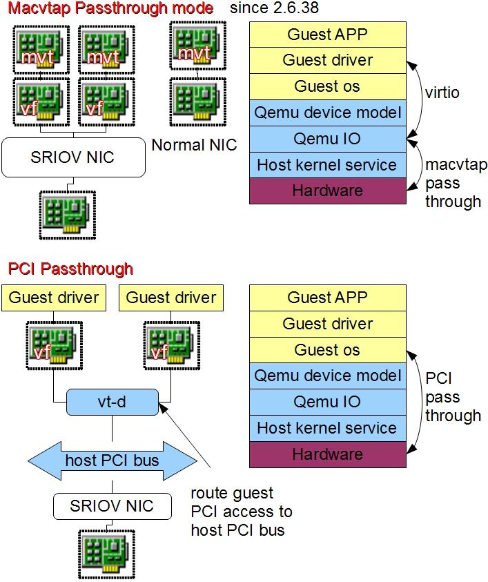

MACVTAP Passthrough 概念与 PCI Passthrough 概念不同，上图详细解释了两种情况的区别。

PCI Passthrough 针对的是任意 PCI 设备，不一定是网络设备，目的是让 Guest OS 直接使用 Host 上的 PCI 硬件以提高效率。以 X86 平台为例，数据将通过需要硬件支持的 VT-D 技术从 Guest OS 直接传递到 Host 硬件上。这样做固然效率很高，但因为模拟器失去了对虚拟硬件的控制，难以同步不同 Host 上的硬件状态，因此当前在使用 PCI Passthrough 的情况下难以做动态迁移。

MACVTAP Passthrough 仅仅针对 MACVTAP 网络设备，目的是绕过内核里 MACVTAP 的部分软件处理过程，转而交给硬件处理。在虚拟化条件下，数据还是会先到达模拟器 I/O 层，再转发到硬件上。这样做效率有损失，但模拟器仍然控制虚拟硬件的状态及数据的走向，可以做动态迁移。

## （4）SR-IOV 介绍

如果网卡支持 SRIOV，请使用 SRIOV PCI Passthrough。

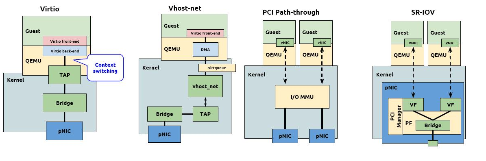

软件模拟是通过 Hypervisor 层模拟虚拟网卡，实现与物理设备完全一样的接口，虚拟机操作系统无须修改就能直接驱动虚拟网卡，其最大的缺点是性能相对较差；

网卡直通支持虚拟机绕过 Hypervisor 层，直接访问物理 I/O 设备，具有最高的性能，但是在同一时刻物理 I/O 设备只能被一个虚拟机独享；

SR-IOV 是 Intel 在 2007 年提出的解决虚拟化网络 I/O 的硬件技术方案，该技术不仅能够继承网卡直通的高性能优势，而且同时支持物理 I/O 设备的跨虚拟机共享，具有较好的应用前景。

原文链接：<https://blog.csdn.net/lsz137105/article/details/100752930>

SR-IOV（Single Root I/O Virtualization）是一个将 PCIe 设备（如网卡）共享给虚拟机的标准，通过为虚拟机提供独立的内存空间、中断、DMA 流，来绕过 VMM 实现数据访问。

SR-IOV 引入了两种 PCIe functions：

- PF（Physical Function）：包含完整的 PCIe 功能，包括 SR-IOV 的扩张能力，该功能用于 SR-IOV 的配置和管理。
- VF（Virtual Function）：包含轻量级的 PCIe 功能。每一个 VF 有它自己独享的 PCI 配置区域，并且可能与其他 VF 共享着同一个物理资源。

SR-IOV 网卡通过将 SR-IOV 功能集成到物理网卡上，将单一的物理网卡虚拟成多个 VF 接口，每个 VF 接口都有单独的虚拟 PCIe 通道，这些虚拟的 PCIe 通道共用物理网卡的 PCIe 通道。每个虚拟机可占用一个或多个 VF 接口，这样虚拟机就可以直接访问自己的 VF 接口，而不需要 Hypervisor 的协调干预，从而大幅提升网络吞吐性能。

## （5）探索虚拟机进程

每一个客户机就是宿主机中的一个 QEMU 进程，而一个客户机的多个 vCPU 就是一个 QEMU 进程中的多个线程。

```bash
[root@centos7 ~]# ps -ef | grep qemu

qemu      52595      1 99 10:37 ?        01:24:12 /usr/libexec/qemu-kvm -name csr1kv-1 -S -machine pc-i440fx-rhel7.0.0,accel=kvm,usb=off,dump-guest-core=off,mem-merge=off -cpu host -m 8192 -mem-prealloc -mem-path /dev/hugepages/libvirt/qemu/7-csr1kv-1 -realtime mlock=on -smp 8,sockets=8,cores=1,threads=1 -uuid 59581018-6387-49df-ab09-2bcf40fc12ba -no-user-config -nodefaults -chardev socket,id=charmonitor,path=/var/lib/libvirt/qemu/domain-7-csr1kv-1/monitor.sock,server,nowait -mon chardev=charmonitor,id=monitor,mode=control -rtc base=utc,driftfix=slew -global kvm-pit.lost_tick_policy=delay -no-hpet -no-shutdown -global PIIX4_PM.disable_s3=1 -global PIIX4_PM.disable_s4=1 -boot strict=on -device piix3-usb-uhci,id=usb,bus=pci.0,addr=0x1.0x2 -device virtio-serial-pci,id=virtio-serial0,bus=pci.0,addr=0x6 -drive file=/home/root/images/csr1000v-universalk9.17.02.01v.qcow2,format=qcow2,if=none,id=drive-virtio-disk0 -device virtio-blk-pci,scsi=off,bus=pci.0,addr=0x7,drive=drive-virtio-disk0,id=virtio-disk0,bootindex=1 -netdev tap,fd=26,id=hostnet0,vhost=on,vhostfd=28 -device virtio-net-pci,netdev=hostnet0,id=net0,mac=52:54:00:36:95:f0,bus=pci.0,addr=0x3 -chardev pty,id=charserial0 -device isa-serial,chardev=charserial0,id=serial0 -chardev socket,id=charchannel0,path=/var/lib/libvirt/qemu/channel/target/domain-7-csr1kv-1/org.qemu.guest_agent.0,server,nowait -device virtserialport,bus=virtio-serial0.0,nr=1,chardev=charchannel0,id=channel0,name=org.qemu.guest_agent.0 -chardev spicevmc,id=charchannel1,name=vdagent -device virtserialport,bus=virtio-serial0.0,nr=2,chardev=charchannel1,id=channel1,name=com.redhat.spice.0 -spice port=5900,addr=127.0.0.1,disable-ticketing,image-compression=off,seamless-migration=on -vga qxl -global qxl-vga.ram_size=67108864 -global qxl-vga.vram_size=67108864 -global qxl-vga.vgamem_mb=16 -global qxl-vga.max_outputs=1 -device vfio-pci,host=1d:00.0,id=hostdev1,bus=pci.0,addr=0x8 -device vfio-pci,host=3b:10.1,id=hostdev0,bus=pci.0,addr=0x4 -msg timestamp=on
```

使用 virsh 命令或 virt-manager 开启虚拟机，是通过调用/usr/libexec/qemu-kvm 并附带虚拟配置的参数，来开启 qemu-kvm 的进程。可以看到上述的参数是非常复杂的，libvirt 提供 XML 参数进行简化。

ps -efL | grep qemu 可以列出所有的线程，但是输出篇幅很长，不在此列出；使用 pstree 可列出其父进程、线程关系，如下：

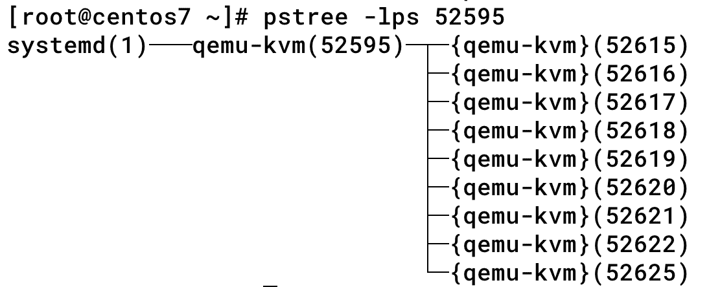

virt-top 可查看虚机运行状态和资源利用率：

[root@centos7 ~]# virt-top -1

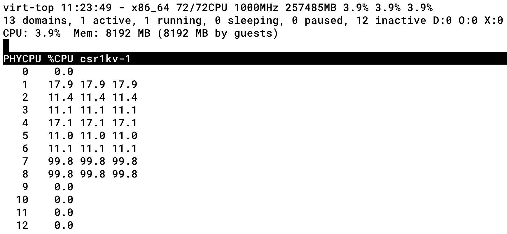

# 参考资料连接

- <https://cloud.tencent.com/developer/article/1703094>
- <https://access.redhat.com/documentation/en-us/red_hat_enterprise_linux/7/html-single/performance_tuning_guide/index>
- <https://access.redhat.com/documentation/zh-cn/red_hat_enterprise_linux/7/html-single/virtualization_tuning_and_optimization_guide/index>
- <https://computingforgeeks.com/how-to-create-and-configure-bridge-networking-for-kvm-in-linux/>
- <https://software.intel.com/content/www/us/en/develop/articles/configure-sr-iov-network-virtual-functions-in-linux-kvm.html>
