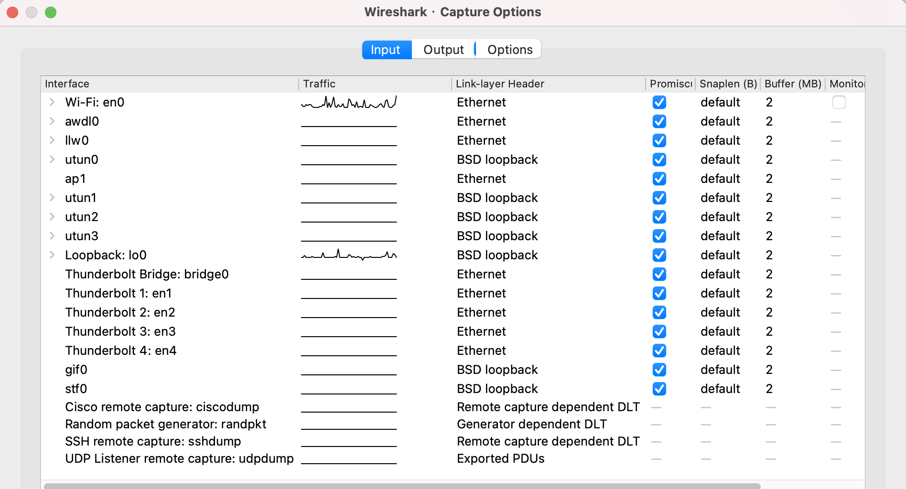
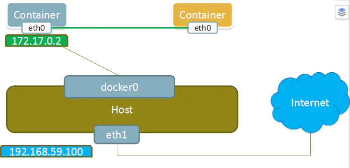
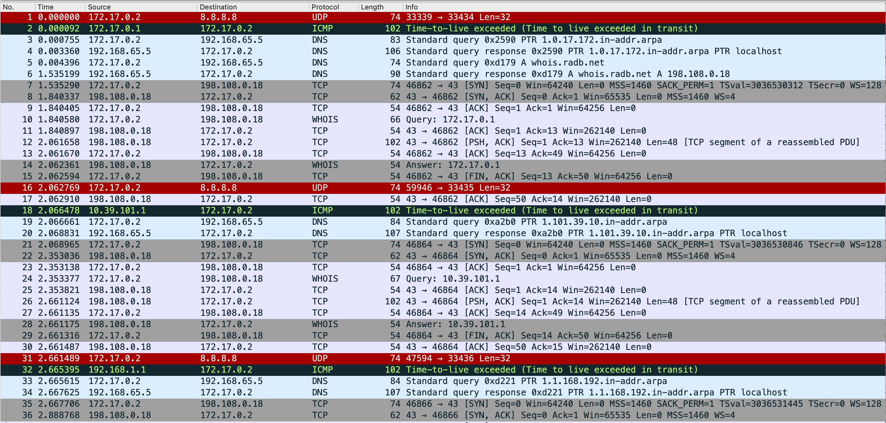
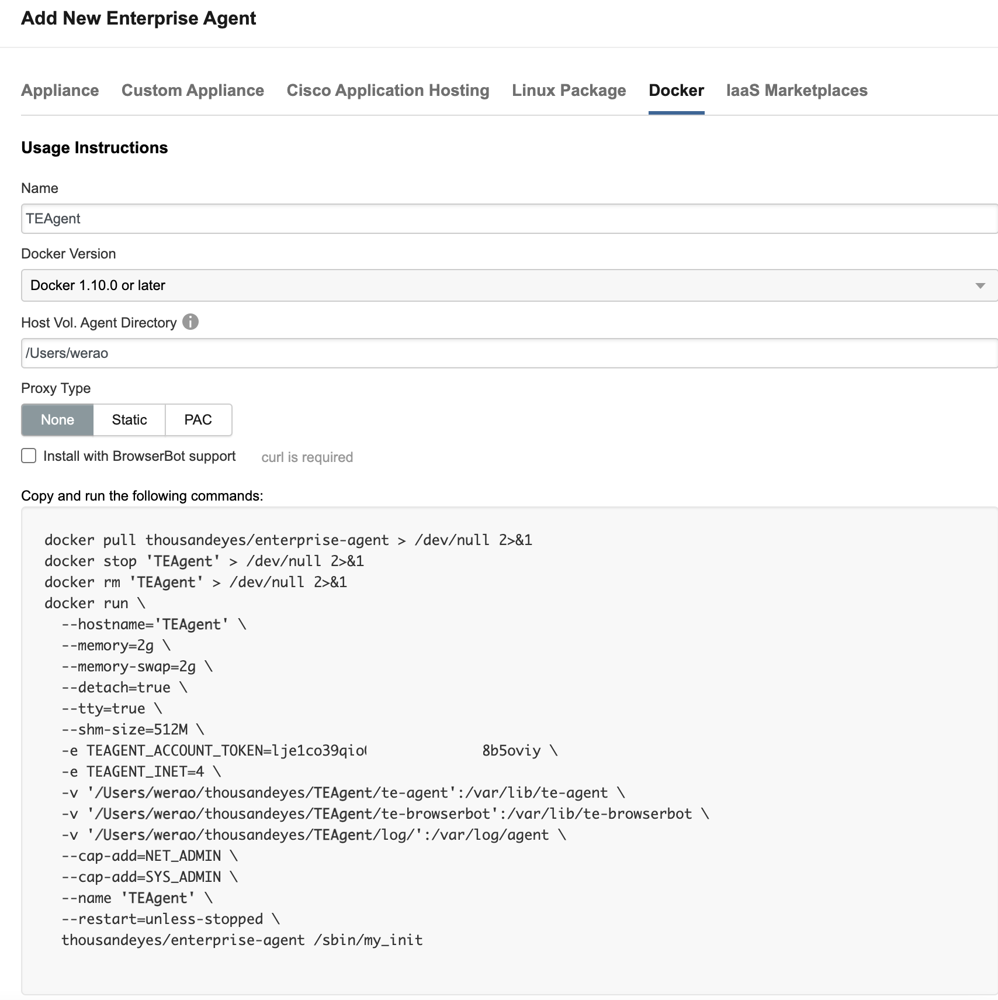
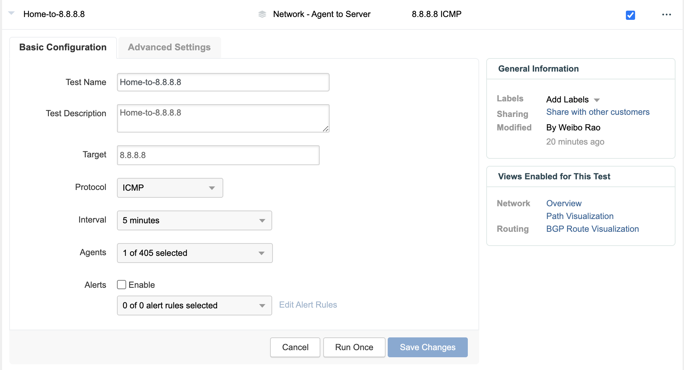
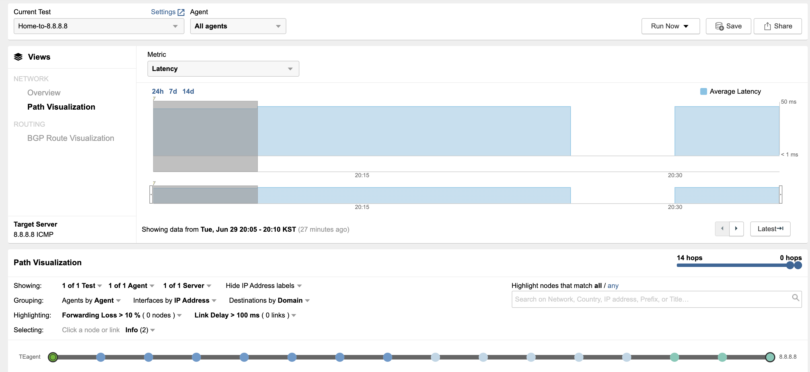
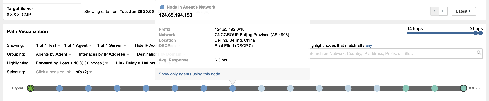
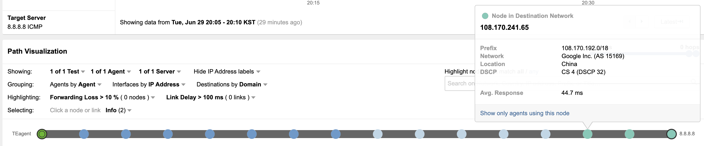
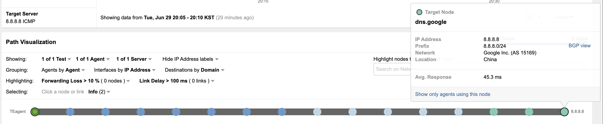

在上一篇文章[《通过Wireshark重新认识Traceroute》](https://weiborao.github.io/get-known-traceroute-by-wireshark.html)中，我在MAC电脑上进行抓包来对MAC上的Traceroute过程进行分析。但是MAC电脑上运行了多个应用，我在抓完报文后，使用过滤器将其他报文过滤掉了，但是也很可能把Traceroute产生的报文给删掉了。

为了打造一个纯净的Traceroute环境，我又使用容器来做一次测试。

本文记录以下内容：

1. 创建一个包含traceroute、ping、whois等工具的容器，取名traceroute
2. 创建一个只包含tcpdump的容器，对traceroute容器抓包
3. 简略的分析抓包文件----不是本文重点

# 创建Traceroute容器镜像

## Dockerfile准备

如果我们执行**docker run -it ubuntu**，想在该容器中执行ping、traceroute命令，抱歉，找不到该命令。

```shell
➜  docker pull ubuntu
➜  docker run -it --rm ubuntu
root@631c227046f7:/# ping 8.8.8.8
bash: ping: command not found
root@631c227046f7:/# traceroute 8.8.8.8
bash: traceroute: command not found
root@631c227046f7:/#
```

这时候，您可以直接在容器里执行：

```shell
root@631c227046f7:/# apt-get update && apt-get install traceroute iputils-ping --no-install-recommends
```

当然，您也可以创建一个容器镜像，如下：

```shell
mkdir traceroute
cd traceroute
touch Dockerfile
```

Dockerfile 内容如下：

```
FROM ubuntu:latest

RUN apt-get update && apt-get install -y \
	traceroute \
	iputils-ping \
	whois \
	netbase \
	iproute2 \
	--no-install-recommends \
	&& rm -rf /var/lib/apt/lists/*
```

注：上述要安装的软件包，是我经过尝试后，一个个增加的。

1. 最开始我只安装了traceroute，当我执行traceroute -A 8.8.8.8时，提示如下错误信息：

   ```shell
   whois.radb.net/nicname: Servname not supported for ai_socktype
   ```

2. 我想起traceroute可能需要调用whois来查询BGP AS号，于是我继续安装whois，仍然报错。----经过验证，如果不安装whois软件包，traceroute -A 8.8.8.8 可正常工作。

3. 只能在网上搜索答案了，果然有人遇到过类似问题：

   ```shell
https://stackoverflow.com/questions/56430294/bash-script-that-uses-whois-command-gets-servname-not-supported-error-on-do
解决办法：
apt-get update && apt-get install -y --no-install-recommends netbase
   ```

4. 安装iproute2的目的是为了执行ip a,  ip link 这些命令。

## 根据Dockerfile创建容器镜像

根据上述的Dockerfile创建容器镜像，执行命令：**docker image build -t traceroute:latest .** 注意末尾的小点，表示当前目录。

```shell
➜  traceroute docker image build -t traceroute:latest .
[+] Building 48.7s (6/6) FINISHED
 => [internal] load build definition from Dockerfile                                                               0.0s
 => => transferring dockerfile: 274B                                                                               0.0s
 => [internal] load .dockerignore                                                                                  0.0s
 => => transferring context: 2B                                                                                    0.0s
 => [internal] load metadata for docker.io/library/ubuntu:latest                                                   0.0s
 => CACHED [1/2] FROM docker.io/library/ubuntu:latest                                                              0.0s
 => [2/2] RUN apt-get update && apt-get install -y  traceroute  iputils-ping  whois  netbase  iproute2  --no-ins  48.5s
 => exporting to image                                                                                             0.1s
 => => exporting layers                                                                                            0.1s
 => => writing image sha256:bbf499e59136872e8d171fddcd1548497a9e76b96d154dcb340b8326252d97d5                       0.0s
 => => naming to docker.io/library/traceroute:latest                                                               0.0s
 
➜  traceroute docker images
REPOSITORY   TAG       IMAGE ID       CREATED          SIZE
traceroute   latest    bbf499e59136   5 seconds ago    77.4MB
```

# 如何抓取容器的网络报文

接下来，需要考虑的问题是在MAC电脑上如何抓取容器的网络报文呢？

## Wireshark on macOS如何抓包？

我执行了docker run -it --name traceroute traceroute 启动了一个名为tracertoute的容器，打开Wireshark，哪一个接口对应的是这个容器的接口呢？



上面的接口眼花缭乱的，找不出是哪一个接口，en0和lo0上有流量，但是并不是容器连接的端口，只得寻求其他方法。

## 基于 Container 网络共享机制来抓包

通过搜索"how to tcpdump in docker"，找到一篇文章[How to TCPdump effectively in Docker](https://xxradar.medium.com/how-to-tcpdump-effectively-in-docker-2ed0a09b5406)，获益匪浅。

该文章介绍了一种Docker的网络模式，container模式。

> In the `--net=container:id` all traffic in/out a specific container (or group of containers) can be captured.

另一篇文章：https://www.freeaihub.com/article/container-module-in-docker-network.html

> Docker网络container模式是指，创建新容器的时候，通过`--net container`参数，指定其和已经存在的某个容器共享一个 Network Namespace。如下图所示，右方黄色新创建的container，其网卡共享左边容器。因此就不会拥有自己独立的 IP，而是共享左边容器的 IP 172.17.0.2,端口范围等网络资源，两个容器的进程通过 lo 网卡设备通信。
>
> 但这两个容器在其他的资源上，如文件系统、进程列表等还是隔离的。
>
> 

专门创建一个安装了tcpdump的容器，对上文创建的traceroute容器进行抓包。

参考[How to TCPdump effectively in Docker](https://xxradar.medium.com/how-to-tcpdump-effectively-in-docker-2ed0a09b5406)，在Terminal中执行以下命令，创建一个tcpdump的容器镜像

```shell
docker build -t tcpdump - <<EOF 
FROM ubuntu 
RUN apt-get update && apt-get install -y tcpdump 
CMD tcpdump -i eth0 -w /var/traceroute-ubuntu.pcapng
EOF
```

创建过程如下：

```
[+] Building 0.1s (6/6) FINISHED
 => [internal] load build definition from Dockerfile                                                               0.0s
 => => transferring dockerfile: 159B                                                                               0.0s
 => [internal] load .dockerignore                                                                                  0.0s
 => => transferring context: 2B                                                                                    0.0s
 => [internal] load metadata for docker.io/library/ubuntu:latest                                                   0.0s
 => [1/2] FROM docker.io/library/ubuntu                                                                            0.0s
 => CACHED [2/2] RUN apt-get update && apt-get install -y tcpdump                                                  0.0s
 => exporting to image                                                                                             0.0s
 => => exporting layers                                                                                            0.0s
 => => writing image sha256:d5d8942d4836fabbb0343a082d9aa0009c6dd5071c70a54ae57baf6728462562                       0.0s
 => => naming to docker.io/library/tcpdump                                                                         0.0s
```

镜像列表：

```shell
➜  traceroute docker images
REPOSITORY   TAG       IMAGE ID       CREATED          SIZE
tcpdump      latest    d5d8942d4836   3 minutes ago    109MB
traceroute   latest    bbf499e59136   35 minutes ago   77.4MB
ubuntu       latest    9873176a8ff5   11 days ago      72.7MB
```

启动traceroute容器：

```shell
➜ docker run -it --name traceroute traceroute
root@fbe3eb98ae63:/#
```

启动tcpdump容器，进行抓包：

```shell
➜  ~ docker run -it --net=container:traceroute tcpdump
tcpdump: listening on eth0, link-type EN10MB (Ethernet), capture size 262144 bytes
```

在traceroute容器发起traceroute：

```shell
root@fbe3eb98ae63:/# traceroute -A -q 1 -N 1 -z 500 -e 8.8.8.8
traceroute to 8.8.8.8 (8.8.8.8), 30 hops max, 60 byte packets
 1  localhost (172.17.0.1) [*]  0.129 ms
 2  localhost (10.39.101.1) [*]  3.716 ms
 3  localhost (192.168.1.1) [*]  3.926 ms
 4  222.129.32.1 (222.129.32.1) [AS4808]  6.837 ms
 5  61.148.163.181 (61.148.163.181) [AS4808]  9.247 ms
 6  219.232.11.65 (219.232.11.65) [AS17431]  7.049 ms
 7  61.149.203.205 (61.149.203.205) [AS4808]  7.650 ms
 8  219.158.7.22 (219.158.7.22) [AS4837]  40.815 ms
 9  219.158.103.218 (219.158.103.218) [AS4837]  64.771 ms
10  219.158.103.30 (219.158.103.30) [AS4837]  50.402 ms
11  219.158.10.30 (219.158.10.30) [AS4837]  53.261 ms
12  219.158.33.174 (219.158.33.174) [AS4837]  55.503 ms
13  108.170.241.65 (108.170.241.65) [AS15169]  54.876 ms
14  142.251.64.173 (142.251.64.173) [AS15169]  45.966 ms
15  dns.google (8.8.8.8) [AS15169]  52.492 ms
```

**traceroute -A -q 1 -N 1 -z 500 -e 8.8.8.8** 参数解释如下：

- -A： 	向radb.net查找对应节点IP所在的AS Path信息，并将查询信息输出
- -q 1：  将缺省发送3个探测包改为1个
- -N 1： 将并发16个探测改为一次一个，以便于逐个分析
- -z 500： 表示每次等待500毫秒再发出下一个探测
- -e：    显示ICMP的扩展消息，如果有的话

按下CTRL+C，停止tcpdump容器的抓包：

```shell
➜  ~ docker run -it --net=container:traceroute tcpdump
tcpdump: listening on eth0, link-type EN10MB (Ethernet), capture size 262144 bytes
^C237 packets captured
237 packets received by filter
0 packets dropped by kernel
```

该容器在抓完包后自动停止，并将抓包文件存储在容器内部的/var/traceroute-ubuntu.pcapng，通过**docker cp**命令将抓包文件拷贝出来。

```shell
➜  ~ docker ps -a
CONTAINER ID   IMAGE        COMMAND                  CREATED          STATUS                        PORTS     NAMES
f397f50267ae   tcpdump      "/bin/sh -c 'tcpdump…"   2 minutes ago    Exited (130) 20 seconds ago             condescending_cori
fbe3eb98ae63   traceroute   "bash"                   48 minutes ago   Up 48 minutes                           traceroute
➜  ~ docker cp f397f50267ae:/var/traceroute-ubuntu.pcapng ./
```

# 简略分析抓包文件

以下是本次抓取的237个报文的头36个报文，如下：



上图中，Wireshare直接分析出来Whois报文。

过程概述如下：

1. 向8.8.8.8发起UDP报文，目的端口为**33434**，TTL设置为1
2. 收到路由器的ICMP TTL超时消息，获取路由器对应的IP地址
3. 尝试向DNS服务器查询路由器IP地址的反向域名解析，如果得到域名，就将其显示在Traceroute的输出结果中。
4. 发起DNS查询，查询**whois.radb.net**域名，得到应答为198.108.0.18
5. 发起TCP连接请求，与198.108.0.18建立TCP连接。
6. 向**whois.radb.net**发起查询，询问路由器IP地址对应的AS号，并得到回应，如果是私有地址，其AS号为0。
7. 重复上述第1、2、3、6步，每次将TTL加1，直至目标地址接收到探测报文，并返回ICMP Port Unreachable消息。

[抓包文件下载](docker-traceroute-tcpdump/traceroute-ubuntu.pcapng)

# 番外篇

ThousandEyes的介绍可参考这篇文章[《在AWS上部署TE Agent并进行测试》](https://weiborao.github.io/deploy-thousandeyes-agent-on-aws.html)。

ThousandEyes可将探针部署到容器中，而且安装十分简单，从ThousandEyes的Cloud & Enterprise Agents中，选择Agent Settings，再选择Enterprise Agents，再点击Add New Enterprise Agent，切换到Docker这个TAB。



将下面的文字复制粘贴到Terminal终端：

```shell
docker pull thousandeyes/enterprise-agent > /dev/null 2>&1
docker stop 'TEagent' > /dev/null 2>&1
docker rm 'TEagent' > /dev/null 2>&1
docker run \
  --hostname='TEagent' \
  --memory=2g \
  --memory-swap=2g \
  --detach=true \
  --tty=true \
  --shm-size=512M \
  -e TEAGENT_ACCOUNT_TOKEN=lje1co39qi       8b5oviy \
  -e TEAGENT_INET=4 \
  -v '/Users/werao/thousandeyes/TEagent/te-agent':/var/lib/te-agent \
  -v '/Users/werao/thousandeyes/TEagent/te-browserbot':/var/lib/te-browserbot \
  -v '/Users/werao/thousandeyes/TEagent/log/':/var/log/agent \
  --cap-add=NET_ADMIN \
  --cap-add=SYS_ADMIN \
  --name 'TEagent' \
  --restart=unless-stopped \
  thousandeyes/enterprise-agent /sbin/my_init
```

安装完后，ThousandEyes即可使用该Agent进行测试了。

创建一个简单的探测如下：



在ThousandEyes的界面，可观测上述的探测结果：

时延比较稳定，维持在50ms左右。



路径可视化分析中，当我们把鼠标落在某个节点上，网页会弹出交互式的信息，包括：

- 网络前缀信息，如：124.65.192.0/18
- 运营商AS信息，如：CNCGROUP Beijing Province (AS 4808)
- 地理位置，如：Beijing, Beijing, China
- DSCP
- 平均时延，指从探测的Agent到对应节点的平均时延








ThousandEyes的探针所收集的数据是常规的网络工具都能收集到的，ThousandEyes的平台对收集到的数据进行存储、分析、交叉关联，为用户的数字体验提供全方位的洞见。

本节是突发奇想的内容，故而放到番外篇。


全文完。
