# 初识Traceroute

Traceroute是一种常见的网络分析工具，用于探测数据包从源地址到目的地址经过的路由器的IP地址。

以下的示例显示从一个MAC电脑到8.8.8.8的路径探测结果：

```shell
➜  ~ traceroute 8.8.8.8
traceroute to 8.8.8.8 (8.8.8.8), 64 hops max, 52 byte packets
 1  localhost (10.39.101.1)  8.662 ms  1.307 ms  1.155 ms
 2  localhost (192.168.1.1)  2.287 ms  2.157 ms  1.897 ms
 3  222.129.32.1 (222.129.32.1)  5.844 ms  13.092 ms  10.332 ms
 4  114.244.95.105 (114.244.95.105)  7.541 ms
    61.51.101.101 (61.51.101.101)  7.420 ms
    61.148.163.81 (61.148.163.81)  7.075 ms
 5  61.148.4.213 (61.148.4.213)  7.759 ms
    219.232.11.65 (219.232.11.65)  5.976 ms
    bt-230-081.bta.net.cn (202.106.230.81)  6.021 ms
 6  202.96.12.13 (202.96.12.13)  7.828 ms * *
 7  219.158.112.26 (219.158.112.26)  39.486 ms *
    219.158.7.22 (219.158.7.22)  45.959 ms
 8  219.158.103.218 (219.158.103.218)  48.469 ms
    219.158.97.2 (219.158.97.2)  47.146 ms
    219.158.103.218 (219.158.103.218)  50.320 ms
 9  219.158.103.30 (219.158.103.30)  50.739 ms  50.382 ms  48.348 ms
10  219.158.10.30 (219.158.10.30)  49.927 ms  44.264 ms  56.353 ms
11  219.158.33.174 (219.158.33.174)  54.123 ms  61.131 ms  47.302 ms
12  108.170.241.97 (108.170.241.97)  56.082 ms
    108.170.241.33 (108.170.241.33)  52.942 ms  54.393 ms
13  142.250.58.189 (142.250.58.189)  48.958 ms
    209.85.143.37 (209.85.143.37)  51.217 ms
    108.170.226.115 (108.170.226.115)  141.544 ms
14  dns.google (8.8.8.8)  48.935 ms  46.364 ms  51.043 ms

➜  ~ ping 8.8.8.8
PING 8.8.8.8 (8.8.8.8): 56 data bytes
64 bytes from 8.8.8.8: icmp_seq=0 ttl=113 time=52.060 ms
64 bytes from 8.8.8.8: icmp_seq=1 ttl=113 time=44.845 ms
64 bytes from 8.8.8.8: icmp_seq=2 ttl=113 time=52.393 ms
64 bytes from 8.8.8.8: icmp_seq=3 ttl=113 time=51.059 ms
64 bytes from 8.8.8.8: icmp_seq=4 ttl=113 time=44.437 ms
64 bytes from 8.8.8.8: icmp_seq=5 ttl=113 time=44.534 ms
^C
--- 8.8.8.8 ping statistics ---
6 packets transmitted, 6 packets received, 0.0% packet loss
round-trip min/avg/max/stddev = 44.437/48.221/52.393/3.640 ms
```

输出结果表明：
1. 从MAC电脑到8.8.8.8的路径包含14个网络节点。
2. 每个节点后面都显示时延信息，表明从MAC电脑到该节点的往返时延。您可能会发现，中间的某些节点往返时延可能要高于更远的节点的往返时延。这是由于该时延包含了路由器将TTL=0的报文交给控制面处理的时延，因而往往比路径上的传播时延要高，尤其是当控制面CPU繁忙时。Traceroute对每一个节点发出3个探测报文，每个报文的路径不尽相同，例如在第4、5、7、8、12、13跳经过不同的路由器转发。
3. 有的探测没有得到回应，因此在有的节点本应显示时延信息的，显示了\*。这并不能断定中间的网络不可达，很可能的原因是该节点的路由器在接口上配置了 ***no ip unreachable*** 命令，该接口不回应ICMP Unreachable消息，而该消息正是Traceroute探测路径所依赖的信息来源。

接下来，我们简要描述一下，在MAC电脑下，Traceroute的工作原理，并使用Wireshark进一步的探究Traceroute的工作过程。

# Traceroute的工作原理

每当IP数据包经过一个路由器，其存活时间TTL就会减1。当其存活时间是0时，主机便取消数据包，并发送一个ICMP TTL超时数据包给原数据包的发出者。Traceroute程序通过向目的地址发送一系列的探测包，设置探测包的TTL初始值分别为1,2,3…，根据返回的超时通知（ICMP Time Exceeded Message）得到源地址与目的地址之间的每一跳路由信息。

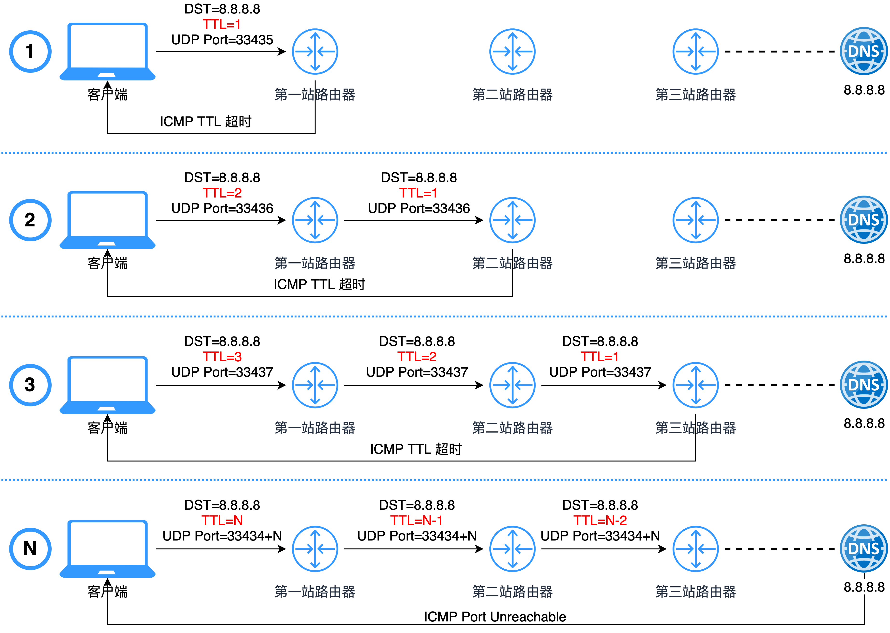

1. 从源地址发出一个UDP探测包到目的地址，并将TTL设置为1；

2. 到达路由器时，将TTL减1；

3. 当TTL变为0时，包被丢弃，路由器向源地址发回一个ICMP超时通知（ICMP Time Exceeded Message），内含发送IP包的源地址，IP包的所有内容及路由器的IP地址；

4. 当源地址收到该ICMP包时，显示这一跳路由信息；

5. 重复1～5，并每次设置TTL加1；

6. 直至目标地址收到探测数据包，并返回端口不可达通知（ICMP Port Unreachable）；

7. 当源地址收到ICMP Port Unreachable包时停止traceroute。

以上内容引自[Traceroute/tracert原理和实践](https://blog.csdn.net/shb_derek1/article/details/100097050)

# 通过Wireshark探究Traceroute

## 在Traceroute输出结果中显示AS号

在Mac电脑的Traceroute命令中，通过'-a'的参数可以开启路径中遇到的IP地址所在的BGP AS号，以便于获知路径中每一跳所归属的运营商，通过'-q 1'可将缺省发送3个探测报文改为发送1个探测报文，输出示例如下：
```shell
➜  ~ traceroute -aq 1 8.8.8.8
traceroute to 8.8.8.8 (8.8.8.8), 64 hops max, 52 byte packets
 1  [AS0] bogon (10.39.101.1)  2.424 ms
 2  [AS0] localhost (192.168.1.1)  3.031 ms
 3  [AS4808] 222.129.32.1 (222.129.32.1)  6.496 ms
 4  [AS4808] 61.51.101.101 (61.51.101.101)  8.114 ms
 5  [AS17431] 219.232.11.29 (219.232.11.29)  5.865 ms
 6  [AS4808] 202.96.12.13 (202.96.12.13)  6.558 ms
 7  [AS4837] 219.158.112.46 (219.158.112.46)  44.826 ms
 8  [AS4837] 219.158.103.218 (219.158.103.218)  52.181 ms
 9  [AS4837] 219.158.103.30 (219.158.103.30)  47.851 ms
10  [AS4837] 219.158.10.30 (219.158.10.30)  56.963 ms
11  [AS4837] 219.158.33.174 (219.158.33.174)  46.523 ms
12  [AS15169] 108.170.241.1 (108.170.241.1)  48.503 ms
13  [AS15169] 172.253.64.111 (172.253.64.111)  142.926 ms
14  [AS15169] dns.google (8.8.8.8)  52.208 ms
```
上述的AS编号信息是如何获得的？下面我们通过Wireshark抓取报文进行分析。

## 上述Traceroute的收发包过程简述
开启Wireshark，并迅速执行**traceroute -aq 1 8.8.8.8**，Traceroute完整输出后，停止Wireshark的报文抓取。
针对抓取的报文进行过滤，在过滤框中输入 **udp or icmp or ip.addr == 198.108.0.18**
经过Wireshark的报文分析，以下为Traceroute的简要的收发包过程：

1. 发起DNS查询，查询**whois.radb.net**域名，得到应答为198.108.0.18----上述过滤器中IP地址来源于此。
2. 发起TCP连接请求，与198.108.0.18建立TCP连接。
3. 向8.8.8.8发起UDP报文，目的端口为33435，TTL设置为1
4. 收到路由器的ICMP TTL超时消息，获取路由器对应的IP地址
5. 向**whois.radb.net**发起查询，询问路由器IP地址对应的AS号，并得到回应，如果是私有地址，其AS号为0。
6. 尝试向DNS服务器查询路由器IP地址的反向域名解析，如果得到域名，就将其显示在Traceroute的输出结果中。
7. 重复上述第3~6步，每次将TTL加1，直至目标地址接收到探测报文，并返回ICMP Port Unreachable消息。

## Wireshark抓包详细分析
下图为Wireshark抓取的报文的前36个：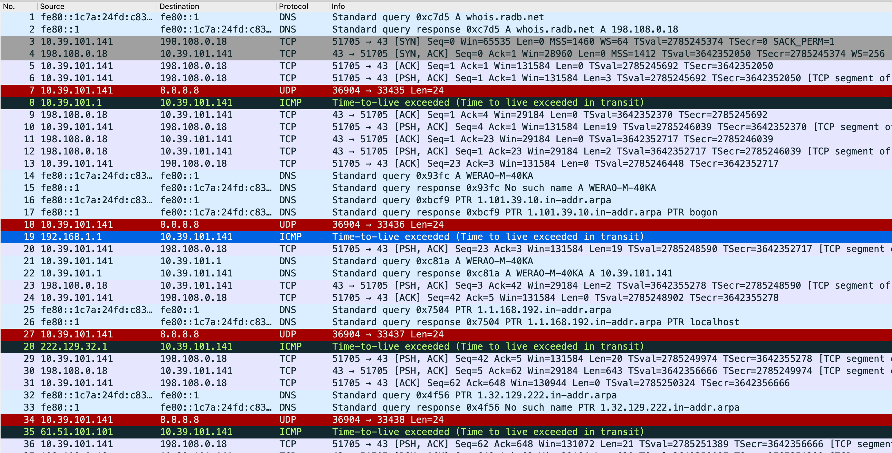

1. 第1和第2个报文为DNS查询，查询whois.radb.net的地址为198.108.0.18。

2. 第3~5的报文为TCP三次握手，并成功建立TCP 连接10.39.101.141:51705<--->198.108.0.18:43，TCP 43端口通常是whois server的端口。

3. 第6个报文由10.39.101.141发向198.108.0.18，并将PSH置位，请求接收端一收到就进行向上交付，以缩短Traceroute的等待时间。

4. 第7个报文发出第一个UDP的探测报文，目标端口号为33435，TTL=1，具体如下：

   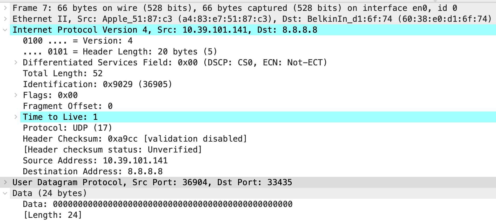

5. 第8个报文为网关回复的ICMP Time-to-live exceeded (Time to live exceeded in transit)报文，Traceroute从IP报文中的源地址获取路由器的IP地址10.39.101.1。该报文包含原始的UDP报文信息，具体如下：

   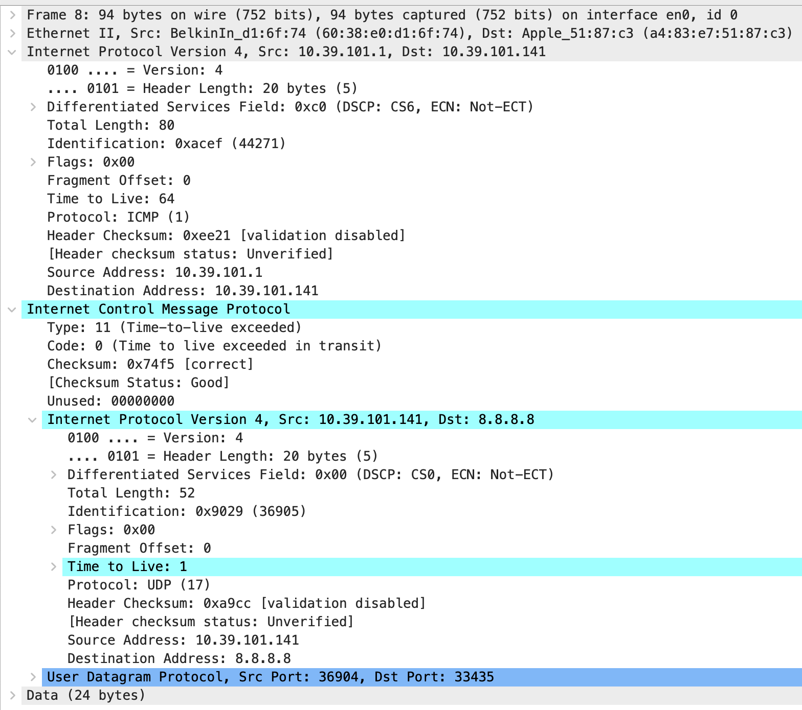

6. 第9个报文为第6个报文的TCP确认报文，第10个报文为向whois.radb.net查询网关10.39.101.1/32所在的AS号。第11个报文为第10个报文的TCP确认，第12个报文答复查询结果，由于该地址为私有IP地址段，没有查询到结果，因此Traceroute 将AS号显示为[AS0]。以下使用第29和30报文，用于展示AS号查询的报文，如下：
  
  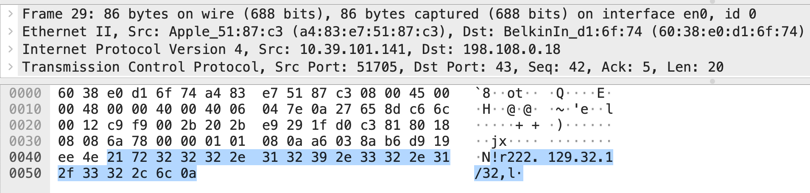
  
  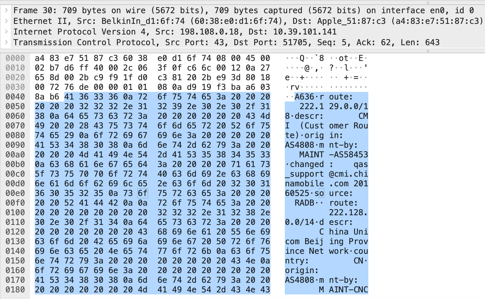
  
  查询结果的文本内容如下：
  
  ```text
  route:      222.129.0.0/18
  descr:      CMI  (Customer Route)
  origin:     AS4808
  mnt-by:     MAINT-AS58453
  changed:    qas_support@cmi.chinamobile.com 20160525
  source:     RADB
  
  route:          222.128.0.0/14
  descr:          China Unicom Beijing Province Network
  country:        CN
  origin:         AS4808
  mnt-by:         MAINT-CNCGROUP-RR
  changed:        abuse@cnc-noc.net 20160516
  source:         APNIC
  
  route:      222.129.0.0/18
  descr:      CMI IP Transit
  origin:     AS4808
  admin-c:    MAINT-CMI-INT-HK
  tech-c:     MAINT-CMI-INT-HK
  mnt-by:     MAINT-CMI-INT-HK
  changed:    qas_support@cmi.chinamobile.com 20160525
  source:     NTTCOM
  ```
  
7. 第14~17报文是DNS解析报文，分别对主机名WERAO-M-40KA进行域名解析，以及对网关IP 10.39.101.1进行反向域名解析，由于是私有主机名和私有地址，自然公网DNS是解析不出来。以下将针对8.8.8.8进行反向域名解析为dns.google的截图作为示例：

   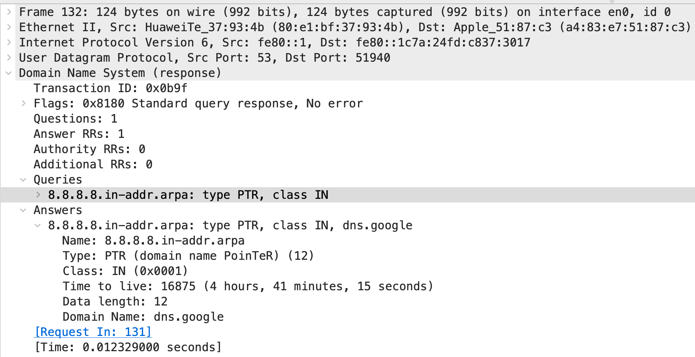

8. 报文18\~26重复报文7\~17的过程，其中报文18的TTL为2，如下：

   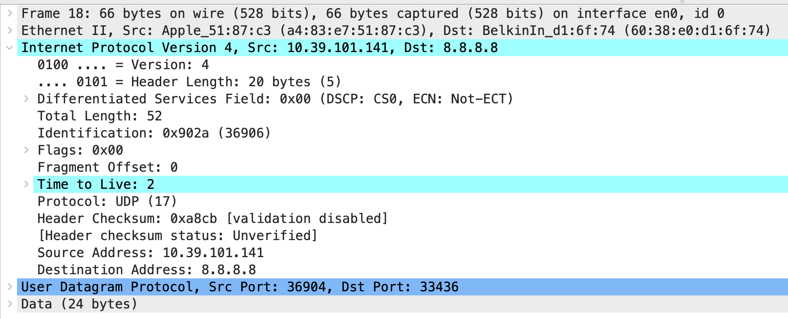

   过程持续至8.8.8.8返回Code: 3 (Port unreachable)的消息，并对8.8.8.8进行反向域名解析。

   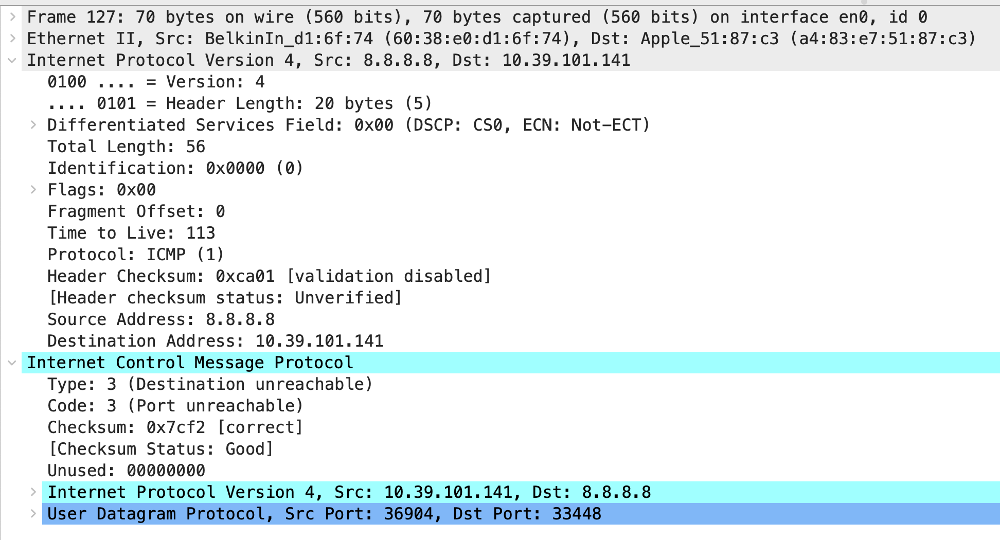

以上详细的分析了**traceroute -aq 1 8.8.8.8**的报文收发过程。

## 后记

在上述的Traceroute完成输出后，Wireshark成功的将Whois的交互报文进行重新组装，并完成内容的解析。

在Wireshark分析完第133个报文后，Wireshark成功的组装出whois的查询报文，如下：

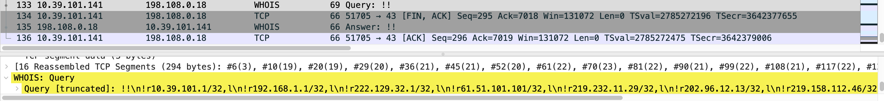

在Wireshark分析完第135个报文后，Wireshark成功的组装出Whois的应答报文，如下：

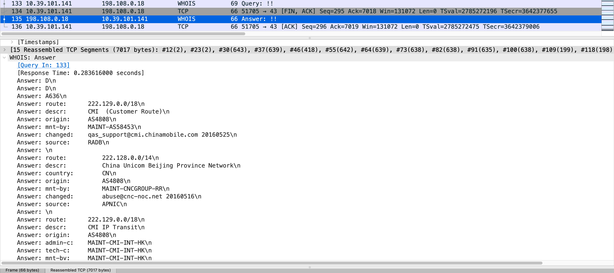


在Terminal执行whois 8.8.8.8/32，并进行报文抓取，解析出Whois的报文应答如下：

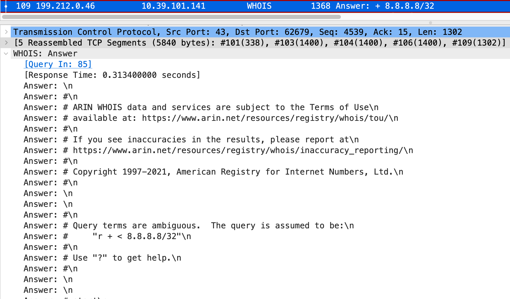

该报文也是Wireshark 拼装了多个TCP Segment，#101、#103、#104、#106、#109后解析出来的。对比该解析结果和上文中，Traceroute过程中的查询结果，可以发现，报文结构是一致的，都被Wireshark解析成Whois的报文。

据此，我推测，MAC电脑上的Traceroute 在增加了-a的参数后，会主动发起Whois查询，缺省的Whois服务器是whois.radb.net。

此部分内容是在Traceroute收发包过程分析完成后，再后知后觉发现的，因此将此部分内容作为“后记”进行记录。

# Traceroute 进阶版工具MTR

MTR （My Traceroute）工具将ping和traceroute命令的功能并入了同一个工具中，实现更强大的功能。相对于traceroute命令只会做一次链路跟踪测试，mtr命令会对链路上的相关节点做持续探测并给出相应的统计信息。

如下为MTR的输出：

```shell
➜  ~ sudo mtr -ry 4 8.8.8.8
Start: 2021-06-27T23:37:21+0800
HOST: WERAO-M-40KA                Loss%   Snt   Last   Avg  Best  Wrst StDev
  1. ???        localhost          0.0%    10    1.8   2.2   1.2  10.1   2.8
  2. ???        bogon              0.0%    10    2.2   2.3   1.9   3.3   0.5
  3. 2003-11-19 222.129.32.1       0.0%    10    6.3   9.5   5.0  29.2   7.7
  4. 2000-03-14 61.148.163.181     0.0%    10    5.3   7.4   5.3   8.7   1.2
  5. 2002-04-17 219.232.11.65     70.0%    10    5.4   6.1   5.4   6.8   0.7
  6. 2006-01-09 124.65.194.153    30.0%    10   28.9   9.6   5.7  28.9   8.5
  7. 2002-03-21 219.158.112.26    40.0%    10   38.9  44.2  38.5  63.7   9.7
  8. 2002-03-21 219.158.19.66      0.0%    10   74.4  64.1  46.4  74.4   8.8
  9. 2002-03-21 219.158.97.25      0.0%    10   90.8  90.8  82.2  96.7   4.3
 10. 2002-03-21 219.158.20.94      0.0%    10   97.5  89.8  74.1 104.6  11.8
 11. 2002-03-21 219.158.33.174     0.0%    10   73.0  62.1  49.7  74.0   8.5
 12. 2012-02-07 108.170.241.65     0.0%    10   59.0  67.3  53.1  75.4   7.2
 13. 2013-04-04 172.253.69.229    10.0%    10   62.9  68.3  54.5  76.6   6.5
 14. 1992-12-01 dns.google         0.0%    10   71.0  65.6  56.4  71.0   5.7
```

MTR命令，通过-r 输出报告，-z 可输出地址所在的AS号，-y 4 可输出该地址的分配时间。

输出信息解释如下：

- 第一列（Host）：节点IP地址和域名。
- 第二列（Loss%）：节点丢包率。
- 第三列（Snt）：发送的Ping包数。默认值是10，可以通过参数“-c”指定。
- 第四列（Last）：最近一次的探测延迟值。
- 第五、六、七列（Avg、Best、Wrst）：分别是探测延迟的平均值、最小值和最大值。
- 第八列（StDev）：标准偏差。越大说明相应节点越不稳定。

上述解释引用自：[MTR工具使用说明与结果分析](https://help.aliyun.com/knowledge_detail/98706.html)，略有改动。

# Q&A

1. David Tian:  赞，请教下，为什么ipv4的traceroute 会触发用ipv6去查dns呢？

   答：好眼力，好问题~~实际上，我抓取的报文中，每次得到ICMP报文后，Traceroute也会向208.67.222.222发送DNS请求。但是报文是加密的，看不出是什么内容，不能猜测，所以我将这些不确定的报文删除了。208.67.222.222是OpenDNS的DNS服务器，这是Cisco IT设置的DNS服务器。😄

# 附录

以下是Wireshark抓包文件的前60个报文的概览。

| No.  | Source                    | Destination               | Protocol | Info                                                         |
| ---- | ------------------------- | ------------------------- | -------- | ------------------------------------------------------------ |
| 1    | fe80::1c7a:24fd:c837:3017 | fe80::1                   | DNS      | Standard query 0xc7d5 A whois.radb.net                       |
| 2    | fe80::1                   | fe80::1c7a:24fd:c837:3017 | DNS      | Standard query response 0xc7d5 A whois.radb.net A 198.108.0.18 |
| 3    | 10.39.101.141             | 198.108.0.18              | TCP      | 51705 → 43 [SYN] Seq=0 Win=65535 Len=0 MSS=1460 WS=64 TSval=2785245374  TSecr=0 SACK_PERM=1 |
| 4    | 198.108.0.18              | 10.39.101.141             | TCP      | 43 → 51705 [SYN, ACK] Seq=0 Ack=1 Win=28960 Len=0 MSS=1412  TSval=3642352050 TSecr=2785245374 WS=256 |
| 5    | 10.39.101.141             | 198.108.0.18              | TCP      | 51705 → 43 [ACK] Seq=1 Ack=1 Win=131584 Len=0 TSval=2785245692  TSecr=3642352050 |
| 6    | 10.39.101.141             | 198.108.0.18              | TCP      | 51705 → 43 [PSH, ACK] Seq=1 Ack=1 Win=131584 Len=3 TSval=2785245692  TSecr=3642352050 [TCP segment of a reassembled PDU] |
| 7    | 10.39.101.141             | 8.8.8.8                   | UDP      | 36904 → 33435 Len=24                                         |
| 8    | 10.39.101.1               | 10.39.101.141             | ICMP     | Time-to-live exceeded (Time to live exceeded in transit)     |
| 9    | 198.108.0.18              | 10.39.101.141             | TCP      | 43 → 51705 [ACK] Seq=1 Ack=4 Win=29184 Len=0 TSval=3642352370  TSecr=2785245692 |
| 10   | 10.39.101.141             | 198.108.0.18              | TCP      | 51705 → 43 [PSH, ACK] Seq=4 Ack=1 Win=131584 Len=19 TSval=2785246039  TSecr=3642352370 [TCP segment of a reassembled PDU] |
| 11   | 198.108.0.18              | 10.39.101.141             | TCP      | 43 → 51705 [ACK] Seq=1 Ack=23 Win=29184 Len=0 TSval=3642352717  TSecr=2785246039 |
| 12   | 198.108.0.18              | 10.39.101.141             | TCP      | 43 → 51705 [PSH, ACK] Seq=1 Ack=23 Win=29184 Len=2 TSval=3642352717  TSecr=2785246039 [TCP segment of a reassembled PDU] |
| 13   | 10.39.101.141             | 198.108.0.18              | TCP      | 51705 → 43 [ACK] Seq=23 Ack=3 Win=131584 Len=0 TSval=2785246448  TSecr=3642352717 |
| 14   | fe80::1c7a:24fd:c837:3017 | fe80::1                   | DNS      | Standard query 0x93fc A WERAO-M-40KA                         |
| 15   | fe80::1                   | fe80::1c7a:24fd:c837:3017 | DNS      | Standard query response 0x93fc No such name A WERAO-M-40KA   |
| 16   | fe80::1c7a:24fd:c837:3017 | fe80::1                   | DNS      | Standard query 0xbcf9 PTR 1.101.39.10.in-addr.arpa           |
| 17   | fe80::1                   | fe80::1c7a:24fd:c837:3017 | DNS      | Standard query response 0xbcf9 PTR 1.101.39.10.in-addr.arpa PTR bogon |
| 18   | 10.39.101.141             | 8.8.8.8                   | UDP      | 36904 → 33436 Len=24                                         |
| 19   | 192.168.1.1               | 10.39.101.141             | ICMP     | Time-to-live exceeded (Time to live exceeded in transit)     |
| 20   | 10.39.101.141             | 198.108.0.18              | TCP      | 51705 → 43 [PSH, ACK] Seq=23 Ack=3 Win=131584 Len=19 TSval=2785248590  TSecr=3642352717 [TCP segment of a reassembled PDU] |
| 21   | 10.39.101.141             | 10.39.101.1               | DNS      | Standard query 0xc81a A WERAO-M-40KA                         |
| 22   | 10.39.101.1               | 10.39.101.141             | DNS      | Standard query response 0xc81a A WERAO-M-40KA A 10.39.101.141 |
| 23   | 198.108.0.18              | 10.39.101.141             | TCP      | 43 → 51705 [PSH, ACK] Seq=3 Ack=42 Win=29184 Len=2 TSval=3642355278  TSecr=2785248590 [TCP segment of a reassembled PDU] |
| 24   | 10.39.101.141             | 198.108.0.18              | TCP      | 51705 → 43 [ACK] Seq=42 Ack=5 Win=131584 Len=0 TSval=2785248902  TSecr=3642355278 |
| 25   | fe80::1c7a:24fd:c837:3017 | fe80::1                   | DNS      | Standard query 0x7504 PTR 1.1.168.192.in-addr.arpa           |
| 26   | fe80::1                   | fe80::1c7a:24fd:c837:3017 | DNS      | Standard query response 0x7504 PTR 1.1.168.192.in-addr.arpa PTR localhost |
| 27   | 10.39.101.141             | 8.8.8.8                   | UDP      | 36904 → 33437 Len=24                                         |
| 28   | 222.129.32.1              | 10.39.101.141             | ICMP     | Time-to-live exceeded (Time to live exceeded in transit)     |
| 29   | 10.39.101.141             | 198.108.0.18              | TCP      | 51705 → 43 [PSH, ACK] Seq=42 Ack=5 Win=131584 Len=20 TSval=2785249974  TSecr=3642355278 [TCP segment of a reassembled PDU] |
| 30   | 198.108.0.18              | 10.39.101.141             | TCP      | 43 → 51705 [PSH, ACK] Seq=5 Ack=62 Win=29184 Len=643 TSval=3642356666  TSecr=2785249974 [TCP segment of a reassembled PDU] |
| 31   | 10.39.101.141             | 198.108.0.18              | TCP      | 51705 → 43 [ACK] Seq=62 Ack=648 Win=130944 Len=0 TSval=2785250324  TSecr=3642356666 |
| 32   | fe80::1c7a:24fd:c837:3017 | fe80::1                   | DNS      | Standard query 0x4f56 PTR 1.32.129.222.in-addr.arpa          |
| 33   | fe80::1                   | fe80::1c7a:24fd:c837:3017 | DNS      | Standard query response 0x4f56 No such name PTR 1.32.129.222.in-addr.arpa |
| 34   | 10.39.101.141             | 8.8.8.8                   | UDP      | 36904 → 33438 Len=24                                         |
| 35   | 61.51.101.101             | 10.39.101.141             | ICMP     | Time-to-live exceeded (Time to live exceeded in transit)     |
| 36   | 10.39.101.141             | 198.108.0.18              | TCP      | 51705 → 43 [PSH, ACK] Seq=62 Ack=648 Win=131072 Len=21 TSval=2785251389  TSecr=3642356666 [TCP segment of a reassembled PDU] |
| 37   | 198.108.0.18              | 10.39.101.141             | TCP      | 43 → 51705 [PSH, ACK] Seq=648 Ack=83 Win=29184 Len=639 TSval=3642358087  TSecr=2785251389 [TCP segment of a reassembled PDU] |
| 38   | 10.39.101.141             | 198.108.0.18              | TCP      | 51705 → 43 [ACK] Seq=83 Ack=1287 Win=130432 Len=0 TSval=2785251697  TSecr=3642358087 |
| 39   | 10.39.101.141             | 10.39.101.1               | DNS      | Standard query 0x521b PTR 1.32.129.222.in-addr.arpa          |
| 40   | 10.39.101.1               | 10.39.101.141             | DNS      | Standard query response 0x521b No such name PTR 1.32.129.222.in-addr.arpa |
| 41   | fe80::1c7a:24fd:c837:3017 | fe80::1                   | DNS      | Standard query 0x5931 PTR 101.101.51.61.in-addr.arpa         |
| 42   | fe80::1                   | fe80::1c7a:24fd:c837:3017 | DNS      | Standard query response 0x5931 No such name PTR  101.101.51.61.in-addr.arpa |
| 43   | 10.39.101.141             | 8.8.8.8                   | UDP      | 36904 → 33439 Len=24                                         |
| 44   | 219.232.11.29             | 10.39.101.141             | ICMP     | Time-to-live exceeded (Time to live exceeded in transit)     |
| 45   | 10.39.101.141             | 198.108.0.18              | TCP      | 51705 → 43 [PSH, ACK] Seq=83 Ack=1287 Win=131072 Len=21 TSval=2785252732  TSecr=3642358087 [TCP segment of a reassembled PDU] |
| 46   | 198.108.0.18              | 10.39.101.141             | TCP      | 43 → 51705 [PSH, ACK] Seq=1287 Ack=104 Win=29184 Len=418 TSval=3642359437  TSecr=2785252732 [TCP segment of a reassembled PDU] |
| 47   | 10.39.101.141             | 198.108.0.18              | TCP      | 51705 → 43 [ACK] Seq=104 Ack=1705 Win=130624 Len=0 TSval=2785253042  TSecr=3642359437 |
| 48   | fe80::1c7a:24fd:c837:3017 | fe80::1                   | DNS      | Standard query 0x7d09 PTR 29.11.232.219.in-addr.arpa         |
| 49   | fe80::1                   | fe80::1c7a:24fd:c837:3017 | DNS      | Standard query response 0x7d09 No such name PTR  29.11.232.219.in-addr.arpa |
| 50   | 10.39.101.141             | 8.8.8.8                   | UDP      | 36904 → 33440 Len=24                                         |
| 51   | 202.96.12.13              | 10.39.101.141             | ICMP     | Time-to-live exceeded (Time to live exceeded in transit)     |
| 52   | 10.39.101.141             | 198.108.0.18              | TCP      | 51705 → 43 [PSH, ACK] Seq=104 Ack=1705 Win=131072 Len=20 TSval=2785254068  TSecr=3642359437 [TCP segment of a reassembled PDU] |
| 53   | 10.39.101.141             | 10.39.101.1               | DNS      | Standard query 0x961b PTR 101.101.51.61.in-addr.arpa         |
| 54   | 10.39.101.1               | 10.39.101.141             | DNS      | Standard query response 0x961b No such name PTR  101.101.51.61.in-addr.arpa |
| 55   | 198.108.0.18              | 10.39.101.141             | TCP      | 43 → 51705 [PSH, ACK] Seq=1705 Ack=124 Win=29184 Len=642 TSval=3642360779  TSecr=2785254068 [TCP segment of a reassembled PDU] |
| 56   | 10.39.101.141             | 198.108.0.18              | TCP      | 51705 → 43 [ACK] Seq=124 Ack=2347 Win=130368 Len=0 TSval=2785254400  TSecr=3642360779 |
| 57   | fe80::1c7a:24fd:c837:3017 | fe80::1                   | DNS      | Standard query 0xb016 PTR 13.12.96.202.in-addr.arpa          |
| 58   | fe80::1                   | fe80::1c7a:24fd:c837:3017 | DNS      | Standard query response 0xb016 No such name PTR 13.12.96.202.in-addr.arpa  SOA beijing.cn.net |
| 59   | 10.39.101.141             | 8.8.8.8                   | UDP      | 36904 → 33441 Len=24                                         |
| 60   | 219.158.112.46            | 10.39.101.141             | ICMP     | Time-to-live exceeded (Time to live exceeded in transit)     |

[抓包文件下载](get-known-traceroute-by-wireshark/traceroute-google-dns.pcapng)

