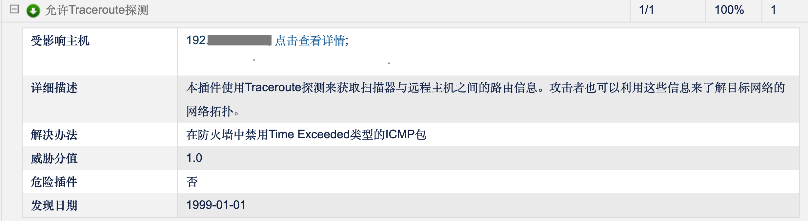
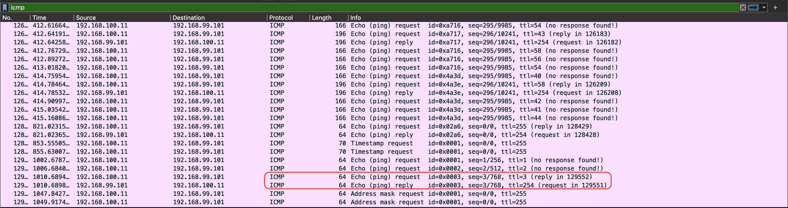
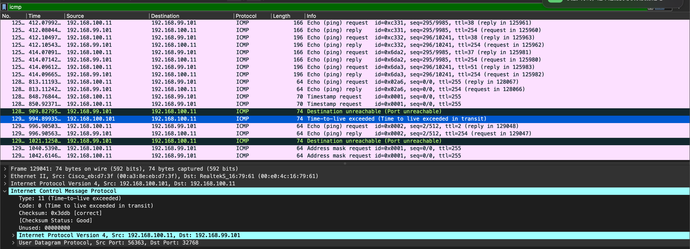

本文将分析一种名为**允许Traceroute探测**的漏洞，对其判定方法进行追查，并提出建议。

## 背景

最近，笔者在做一个网络设备方面的安全合规性的测试，其中有一项是需要使用漏洞扫描设备对被测试的设备进行全面的安全漏洞扫描。在笔者对被测设备进行了针对性的安全加固后，漏洞扫描报告仍然有一个低危漏洞：允许Traceroute探测。该低危漏洞的详细信息如下：

需要说明的一点是，扫描器如需成功扫描到该设备，这个设备的IP地址要求能被扫描器探测到，否则扫描器会认为设备不在线。通常的做法就是允许Ping，具体而言，被测设备至少要允许ICMP Echo Request请求，并应答ICMP Echo Reply。

笔者在被测试设备的接口上配置了ACL，入向仅允许ICMP Echo Request报文，出向仅允许ICMP Echo Reply，但是扫描结果依然判断被测设备允许Traceroute探测。

对此，笔者疑惑不已，下文将展开思考和分析。

<!-- more -->

## 对漏洞的解读

- **详细描述**：使用Traceroute探测来获取扫描器与远程主机之间的路由信息。攻击者也可以利用这些信息来了解目标网络的网络拓扑。

- **解读**：如果扫描器与被测试设备处于同一网段，那么扫描器（充当攻击者角色）与被测设备之间的网络拓扑实际是已知的，即通过二层交换网络互联；根本不需要使用Traceroute来获取路由信息、网络拓扑。按照笔者之前的文章[《通过Wireshark重新认识Traceroute》](https://weiborao.github.io/get-known-traceroute-by-wireshark.html)的分析，如果针对同一个网段的主机进行Traceroute，那么第一个TTL=1的UDP报文发送到该地址后，立刻会收到Port-Unreachable的ICMP报文。如果是Windows系统，tracert会发送TTL=1 的ICMP Echo Request，但是同一网段的地址只是会简单的回复一个ICMP Echo Reply的报文，就宣告结束。不管发送UDP报文还是ICMP报文，整个过程中，不会出现TTL超时的情况，也就不会收到TTL Exceeded的ICMP报文。
- **解决办法**：在防火墙中禁用Time Exceeded类型的ICMP包。
- **推理**：根据解决办法的定义推理：如果防火墙禁用了Time Exceeded类型的ICMP报文，该漏洞就得到解决，那么扫描结果中就不会出现**允许Traceroute探测**的漏洞。也可以说，如果扫描器没有接收到Time Exceeded类型的ICMP包，也就没有发现Traceroute的证据，那么，扫描结果中不能出现**允许Traceroute探测**的漏洞。
- 综合上述的分析，笔者认为，依据漏洞的解决办法进行推理，如果扫描器与被测设备在同一网段，扫描过程中不会收到TTL Exceeded的ICMP包，不能得出被测设备**允许Traceroute探测**这个结论的。
- 简言之，扫描器对于该漏洞的判定原则与其提供的解决办法并不匹配。

## 漏洞判定方法的追查

为了追查扫描器到底如何判定该漏洞，笔者请负责漏洞扫描的工程师设法进行抓包，将扫描过程中扫描器发送/接收的报文进行全量抓取。将抓取到的报文进行分析，有如下发现：

1. 扫描器对被测设备发起随机的TCP端口扫描，因笔者进行了安全加固，被测设备没有回复任何一个TCP报文；
2. 扫描器对被测设备发起其他常见协议的扫描，例如SNMP、SIP、NTP、TFTP等，均未得到响应；
3. 扫描器对被测设备发起基于UDP报文的Traceroute探测，逐一发送TTL=1、2、3的UDP报文，UDP端口号为32768，未得到响应；
4. 扫描器对被测设备发起基于ICMP的Traceroute探测，得到ICMP Echo Reply的回包，如下图：

注：扫描器地址为192.168.100.11，被测设备地址为192.168.99.101，其中隔着一个设备192.168.100.101，均为同一系列的两个不同型号的产品，两个设备的软件版本相同。

笔者设法将TTL=1和TTL=2的报文进行了过滤，但是还有TTL=3的报文继续发送过来。

按照上述的抓包分析来分析，判定原则似乎是逐一发送TTL=1、2、……N，（N>=3）的ICMP Echo Request报文，期望回复TTL Exceeded的报文，实际回复ICMP Echo Reply报文，竟然也判定为**允许Traceroute探测**。

笔者去掉安全加固的策略，重新进行扫描，抓取扫描器的收发报文，如下：

在该图中，我们可以清晰的看到中间的设备192.168.100.101发送的TTL Exceeded报文，从而让扫描器探测到其与远程主机之间的路由信息，网络拓扑信息（发现了中间设备）。

## 建议

通过上述的分析，我们得出结论：

1. 该漏洞扫描程序的判定原则与其提供的解决办法不匹配，即按照解决办法整改后，依然会扫描出**允许Traceroute探测**的漏洞。
2. 通过抓包分析，我们发现其判定原则存在不合理之处，即扫描过程中通过发送TTL=1、2、3……的报文，期望回复ICMP TTL Exceeded，然而在回复了ICMP Echo Reply，仍然会判定为有该漏洞。
3. 执行该漏洞扫描时，不能将扫描器与被测设备进行同网段直连，这样被测设备不会返回ICMP TTL Exceeded报文。

建议：

1. 修改判定原则，使其与解决办法相匹配；
2. 执行该漏洞扫描时，需要在扫描器和被测设备之间至少增加一个路由设备（可为同款测试设备），以便真实的反映出Traceroute的功能。
